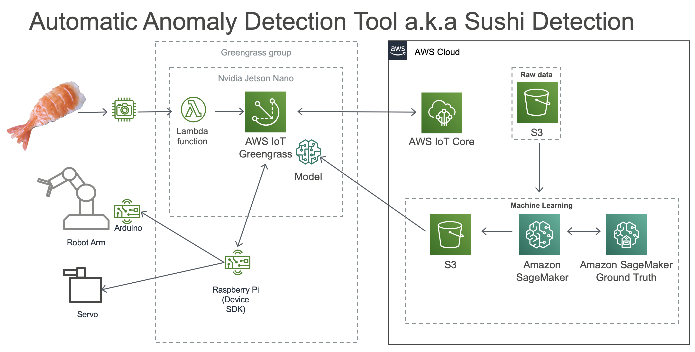
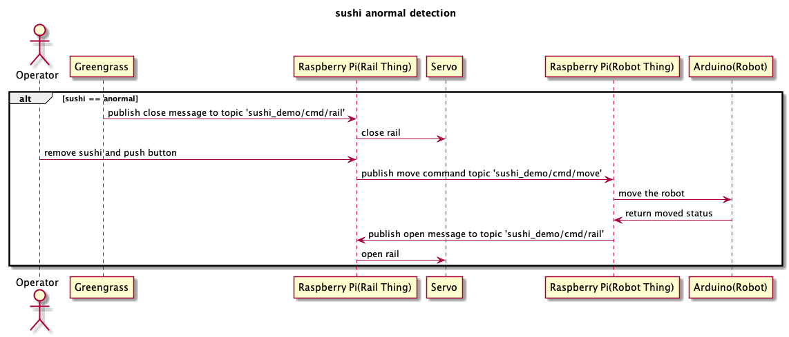
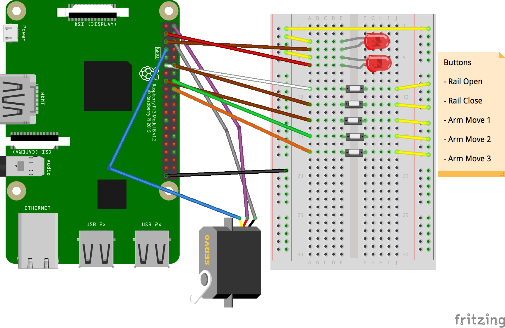

# Automatic Anomaly Detection Tool a.k.a Sushi Detection

This is a sample source code to create Sushi Detection demo.



## Devices

This demo use following devices.

- Nvidia Jetson Nano
- Robot Hand
  - https://store.arduino.cc/usa/tinkerkit-braccio
- Servo Motor
  - https://servodatabase.com/servo/towerpro/sg90
- Arduino Uno Rev3
- USB Web camera

## Message send between devices



## Bread Board Circuit



## 1. Setup AWS resource

### 1.1. Create AWS IoT certificates

This demo have two devices connected to Greengrass. In this step you need to create three certificate for following devices.

- Greengrass Core
- Robot Controller
- Rail Controller

Follow [this step](https://docs.aws.amazon.com/iot/latest/developerguide/create-device-certificate.html) to create certificates. Dont forget to activate and download the generated certificate, private key and public key.

Check each certificate ARN in the certificate detail page. This ARN is use in next step.

### 1.2. Upload files

Download Lambda Function Zip file and Machine Learning Model from following link and upload to your S3 bucket. The region must be same with Cloud Function region.

- Lambda Function
  - [Demo Lambda zip](http://bit.ly/SushiDemoLambda)
- ML Model
  - [Demo ML Model](http://bit.ly/SushiDemoModel)

### 1.3. Create Cloud Formation stack

1. Sign in to the AWS Management Console and open the AWS CloudFormation console at https://console.aws.amazon.com/cloudformation.

2. If this is a new AWS CloudFormation account, click __Create New Stack__. Otherwise, click __Create Stack__. If you choose __Create stact__ from drop down list choose __With new resources (standard)__

3. In the __Template__ section, select __Template is ready__

4. In the __Specify template__ section, select __Upload a template file__. Upload `sushi_cfn.yml`

5. Click __Next__

6. Enter stack name

7. Fill Parameters

|parameter|value|
|-------|-------|
|__GreengrassCoreCertificateARN__|certificate ARN which created at previous step|
|__RailControllerCertificateARN__|certificate ARN which created at previous step|
|__RobotControllerCertificateARN__|certificate ARN which created at previous step|
|__GreengrassGroupName__|your Greengrass name|
|InferenceLambdaSourceKey|S3 object key(lambda funcion)|
|LambdaSourceBucket|S3Bucket(lambda funcion)|
|MLModelURI|ML Model S3 URL|

8. Click __Next__. And click __Next__ again.

9. Review the information for the stack. When you're satisfied with the settings, check __I acknowledge that AWS CloudFormation might create IAM resources.__ and click __Create__.

10. It takes few minutes to complete creating Greengrass.

### 1.4. Download Greengrass software

This demo works for Greengrass version 1.9x.

1. Download Greengrass Core Software from [here](https://docs.aws.amazon.com/greengrass/latest/developerguide/what-is-gg.html#gg-core-download-tab). Choose __Armv8 (AArch64) Ubuntu 18.04__ for Nvidia Jetson Nano.

## 2. Setup Jetson Nano

### 2.1. Create Jetson Nano SD Card

Follow the step on the original setup page.

https://developer.nvidia.com/embedded/learn/get-started-jetson-nano-devkit#write

Boot your Jetson Nano, after you install the image in SD card.
And follow the `Setup and First Boot`.
https://developer.nvidia.com/embedded/learn/get-started-jetson-nano-devkit#setup


### 2.2. Install software

Use terminal on Jetson Nano to install software.

#### Install required software

```
sudo apt-get install -y git build-essential libatlas-base-dev libopencv-dev graphviz vim curl
```

#### Install SageMaker Neo Runtime

Use terminal on Jetson Nano.

```
curl https://s3-us-west-2.amazonaws.com/neo-ai-dlr-release/v1.0/jetsonnano-aarch64-cu10-ubuntu18_04-glibc2_27-libstdcpp3_4/dlr-1.0-py2.py3-none-any.whl -o dlr-1.0-py2.py3-none-any.whl

pip install dlr-1.0-py2.py3-none-any.whl
```

### 2.3 Install Greengrass Core

#### Create user ggc_user and group ggc_group

```
sudo adduser --system ggc_user
sudo groupadd --system ggc_group
```

#### Copy files

1. Copy Greengrass Core software to Jetson Nano.
2. Copy certificate for Greengrass Core to Jetson Nano.
3. Extract Greengrass

```
sudo tar -zxvf greengrass-linux-x86-64-1.9.4.tar.gz -C /
```

4. Copy certificate to Greengrass directory

```
cp /path/to/your/certificate /greengrass/certs/
```

5. Download Root CA certificate

```
sudo curl https://www.amazontrust.com/repository/AmazonRootCA1.pem -o /greengrass/certs/root.ca.pem
```

6. Edit Greengrass config

Replace each part with your environoment.

|part|value|
|----|-----|
|[ROOT_CA_PEM_HERE]|root.ca.pem|
|[CLOUD_PEM_CRT_HERE]|your certificate file name. </br>ex) abcd1234-certificate.pem.crt|
|[CLOUD_PEM_KEY_HERE]|your private key file name. </br>ex) afcf52c6b2-private.pem.key|
|[THING_ARN_HERE]|Greengrass Core ARN </br>ex) arn:aws:iot:us-east-w:1234567890:thing/sushi_Core|
|coreThing.iotHost|check your AWS IoT Endpoint from __AWS IoT console -> Settings -> Custom endpoint__|
|coreThing.ggHost|replace [AWS_REGION_HERE] with your region.|
|runtime.cgroup.useSystemd|`[yes|no]` -> `yes`|
|||

```
sudo vim /greengrass/config/config.json 

{
    "coreThing": {
        "caPath": "[ROOT_CA_PEM_HERE]",
        "certPath": "[CLOUD_PEM_CRT_HERE]",
        "keyPath": "[CLOUD_PEM_KEY_HERE]",
        "thingArn": "[THING_ARN_HERE]",
        "iotHost": "[HOST_PREFIX_HERE]-ats.iot.[AWS_REGION_HERE].amazonaws.com",
        "ggHost": "greengrass-ats.iot.[AWS_REGION_HERE].amazonaws.com"
    },
    "runtime": {
        "cgroup": {
            "useSystemd": "[yes|no]"
        }
    },
    "managedRespawn": false,
    "crypto": {
        "caPath" : "file://certs/[ROOT_CA_PEM_HERE]",
        "principals": {
            "IoTCertificate": {
                "privateKeyPath": "file://certs/[CLOUD_PEM_KEY_HERE]",
                "certificatePath": "file://certs/[CLOUD_PEM_CRT_HERE]"
            },
            "SecretsManager": {
                "privateKeyPath": "file://certs/[CLOUD_PEM_KEY_HERE]"
            }
        }
    }
}

```

### 2.4. Start Greengrass

Connect USB camera before starting Greengrass daemon.

Start Greengrass
```
sudo /greengrass/ggc/core/greengrassd start
```

check Greengrass log.
```
sudo tail -F /greengrass/ggc/var/log/system/runtime.log
```

#### Auto start Greengrass

1. Copy `Greengrass/greengrass.service.txt` to `/etc/systemd/system/greengrass.service`

2. Enable service

```
sudo systemctl enable greengrass.service
```

3. Start service

```
sudo systemctl start greengrass.service
```

#### Deploy Greengrass

See [here](https://docs.aws.amazon.com/greengrass/latest/developerguide/configs-core.html) to deploy Greengrass to your device.

The deployed Lambda Function source code can find in this repo `LambdaFunction` directory.

## 3. Setup Rail Controller and Robot Controller

This demo use Raspberry Pi 3+ to control servo motor and comunicate with Arduino Uno.

### 3.1. Install Raspberry Pi required software

1. Install software

```
sudo pip install AWSIoTPythonSDK
```

### 3.2. Setup Rail Controller

1. rename `appconfig_template.json` to `appconfig.json`
2. edit `appconfig.json` to your environoment

|attribute|value|
|-------|-------|
|IOT_ENDPOINT|your AWS IoT endpoint|
|CERT_FILE|your certificate file name. </br>ex) abcd1234-certificate.pem.crt|
|PRIVATE_KEY_FILE|your private key file name. </br>ex) afcf52c6b2-private.pem.key|
|THING_NAME|your `RailController` thing name|

3. Copy all demo source in this repo `/RailController` to Raspberry Pi `/home/pi/RailController`
4. SSH into Raspberry pi 
5. Correct `WorkingDirectory` and `ExecStart` path in `railcontroller.service.txt`
6. Copy `railcontroller.service.txt` to `/etc/systemd/system/railcontroller.service`

7. Enable service

```
sudo systemctl enable railcontroller.service
```

8. Start service

```
sudo systemctl start railcontroller.service
```

### 3.3. Setup Arduino Uno

Use arduino IDE to compile and install to Arduino Uno.

1. Open `arduino/arduino_robot.ino` with Arduino IDE
2. compile and upload to Arduino Uno

### 3.4. Setup Robot Controller

1. rename `appconfig_template.json` to `appconfig.json`
2. edit `appconfig.json` to your environoment

|attribute|value|
|-------|-------|
|IOT_ENDPOINT|your AWS IoT endpoint|
|CERT_FILE|your certificate file name. </br>ex) abcd1234-certificate.pem.crt|
|PRIVATE_KEY_FILE|your private key file name. </br>ex) afcf52c6b2-private.pem.key|
|THING_NAME|your `RobotController` thing name|

3. Copy all demo source in this repo `/RobotController` to Raspberry Pi `/home/pi/RobotController`
4. SSH into Raspberry pi and move directory to `/home/pi/RobotController`
5. Correct `WorkingDirectory` and `ExecStart` path in `robotcontroller.service.txt`
6. Copy `robotcontroller.service.txt` to `/etc/systemd/system/robotcontroller.service`

7. Enable service

```
sudo systemctl enable robotcontroller.service
```

8. Start service

```
sudo systemctl start robotcontroller.service
```

## Train your own machine learning model

This demo use SageMaker built-in Image Classification template to create model. The created model use SageMaker Neo to compile.

- About built-in Image Classification Algorithm
  - https://docs.aws.amazon.com/sagemaker/latest/dg/image-classification.html
- About compiling with SageMaker Neo
  - https://docs.aws.amazon.com/sagemaker/latest/dg/neo.html

## Use Object Detection with Image Classification

This demo use OpenCV to detect sushi saucer. But you can use Objecte Detection to detect sushi saucer. SageMaker built-in Object Detection Algorithm is not supported at SageMaker Neo(2019/11). If you want to use Object Detection with Image Classification use MXNet.

## Authors ##
- Jun Ichikawa juichika@amazon.com
- Tatsuhiro Iida tatsiida@amazon.com

# License #

This library is licensed under the Apache 2.0 License.