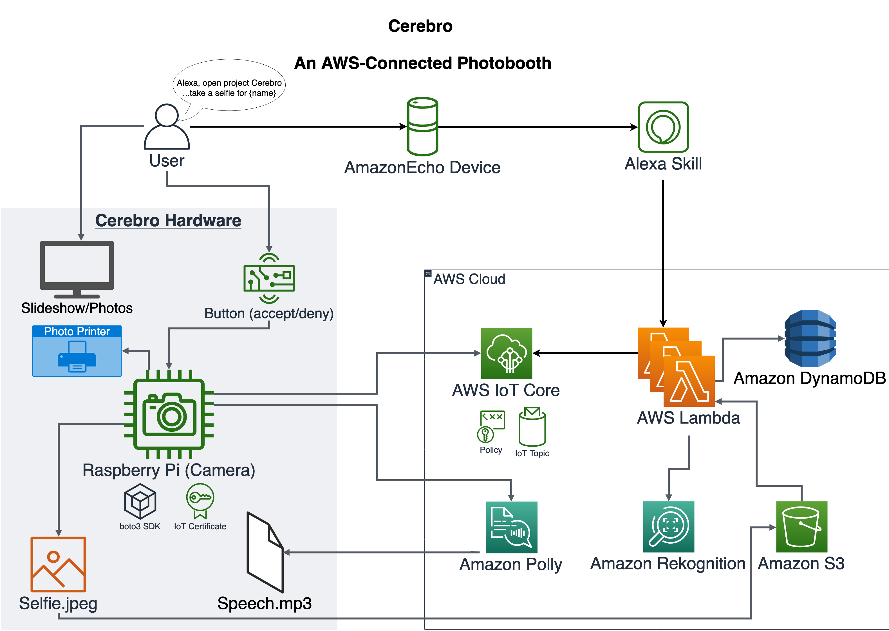

# Connected Photo Booth/Viewer: Party with AI,VR, filters #

## Overview ##

The Connected Photo Booth/Viewer (aka Cerebro) is a new generation photo booth doubling as an always-on digital photo panel. Can be used in parties or in your living room. Allows for single or group photos taken with a canned set of filters. Facial recognition (AI) will enable customizing photo selection.

## Architecture ##

## Installation and Usage
Please see [here](INSTALL.md)

## Authors ##
- Sachin Holla sacholla@amazon.com
- Ronan Prenty rprenty@amazon.com

# License #

This library is licensed under the Apache 2.0 License.
