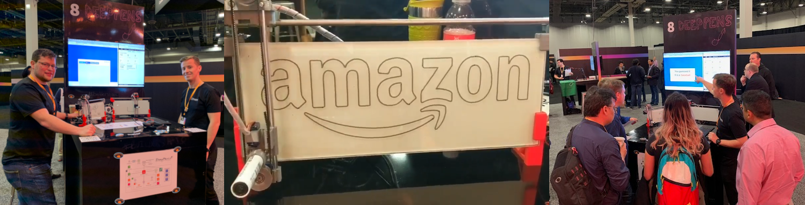
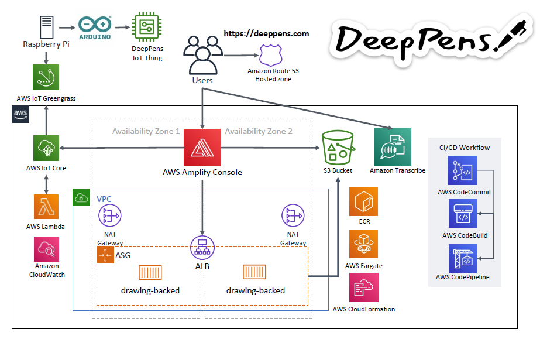

# DeepPens

DeepPens is a voice enabled Internet of Things (IoT) connected robot whiteboard first displayed at the [AWS re:Invent builders fair](https://reinvent.awsevents.com/learn/builders_fair/) 2019.



## Architecture



The DeepPens device was built using:
- **[JJRobots iBoardBot](https://www.jjrobots.com/the-iboardbot/)**
  - This comes with an [Arduino Leonardo](https://www.arduino.cc/en/Main/Arduino_BoardLeonardo) and [JJRobots Brain Shield](https://www.jjrobots.com/product/b-robot-electronic-brain-shield/)
- **Raspberry Pi** - to drive USB serial to iBoardbot, iboardbot-web rust service and AWS IoT Greengrass
- **[Amazon Transcribe](https://aws.amazon.com/transcribe/)** - for text to speech translation
- **[AWS IoT Greengrass](https://aws.amazon.com/greengrass/)** - for invoking AWS Lambda on a Raspberry PI
- **[AWS IoT Core](https://aws.amazon.com/iot-core/)** - for connecting to AWS IoT
- **[AWS Lambda](https://aws.amazon.com/lambda/)** - for invoking a post to a local web server
- **[AWS Fargate](https://aws.amazon.com/fargate/)** - for backend container based API
- **[AWS Amplify Console](https://aws.amazon.com/amplify/console/)** - for single page web application hosting
- **[AWS Cloud Development Kit (CDK)](https://aws.amazon.com/cdk/)** - for deployment of API backend
- **AWS Code Suite ([CodeCommit](https://aws.amazon.com/codecommit/), [CodePipeline](https://aws.amazon.com/codepipeline/), [CodeBuild](https://aws.amazon.com/codebuild/))** for CI/CD
- [iboardbot-web](https://github.com/dbrgn/iboardbot-web) - Custom 3rd party web interface for iBoardbot
- [iboardbot-code](https://github.com/dbrgn/iBoardbot) - Custom 3rd firmware to drive the iBoardbot via USB serial

## Getting started

To get started with your own DeepPens project:

1. Buy and assemble the [JJRobots iBoardBot](https://www.jjrobots.com/the-iboardbot/)
2. Setup a Raspberry Pi with your Linux distribution of choice (we <3 Raspbian!)
3. Install custom [Arduino firmware](https://github.com/dbrgn/iBoardbot) using Arduino IDE via USB
4. Install [iboardbot-web](https://github.com/dbrgn/iboardbot-web) onto the Raspberry Pi
  - This requires the installation of Rust on the Pi, grab some coffee... this may take a while!
  - Install this into /home/pi/iboardbot-web
  - Grab the config from [./iot/config.json](./iot/config.json) and put this into the directory
  - Copy [iboard-web.service](./iot/iboard-web.service) to the Pi
  - Copy [iboardbot](./iot/iboardbot) to /usr/bin and chmod +x it
  - We've also included a [systemd file for greengrassd](./iot/greengrass.service) to make it start on boot
5. Now you should be able to test the implementation via local web server with a test SVG file
6. Ready for IoT connectivity!
7. Install AWS IoT Greengrass onto the Raspberry Pi and setup a new AWS IoT Core device via AWS Console
8. Setup the DeepPens [Lambda](./iot/http_python.py) via AWS IoT Core for deployment onto the Raspberry Pi
9. Deploy backend API
 - The backend API is deployed via AWS CDK, first follow the instructions in the [CDK documentation](https://docs.aws.amazon.com/cdk/latest/guide/getting_started.html) or use the provided buildspec.yml and buildspec-deploy.yml to build the container and deploy the CDK stack via AWS CodeBuild
 - The backend relies on some configuration variables passed to AWS CDK, you will need to create these and update the ARNs within [cdk-fargate-stack.ts](./lib/cdk-fargate-stack.ts)
   - Two secrets in AWS Secrets Manager
     - DrawingBackend-Tag - the container tag name
     - DrawingBacked-IOT_ENDPOINT - the AWS IoT endpoint name created earlier
   - IMAGE_ARN - The ARN to the container repository
10. Alternatively, you could build and deploy the container using:
```
export DOCKER_IMAGE_TAG="1"
docker build -t $AWS_ACCOUNT_ID.dkr.ecr.$AWS_REGION.amazonaws.com/drawing-backend:$DOCKER_IMAGE_TAG -f backend/draw-images/Dockerfile backend/draw-images
docker push $AWS_ACCOUNT_ID.dkr.ecr.$AWS_REGION.amazonaws.com/drawing-backend:$DOCKER_IMAGE_TAG
npm install -g aws-cdk@1.12.0 tslint typescript
npm install
npm run build
cdk bootstrap
cdk synth
cdk deploy
```
10. Deploy Web Frontend - We used AWS Amplify Console for this and you can directly point it to the frontend folder from this git repo

## To-do

### Frontend

- [ ] Add some example SVG files

### Backend

- [ ] Add custom logic to pull from public svg datasets

### CDK Stack

- [ ] Add SecretsManager inital setup and values
- [ ] Add CodeBuild & CodePipeline setup
- [ ] Add ECR repo creation
- [ ] Add Amplify Console site to code for easier deployments

## Authors

- Neil Lock - nlock AT amazon.co.uk
- Tom Ellis - ellistr AT amazon.co.uk

## License

This content is licensed under the Apache 2.0 License.
