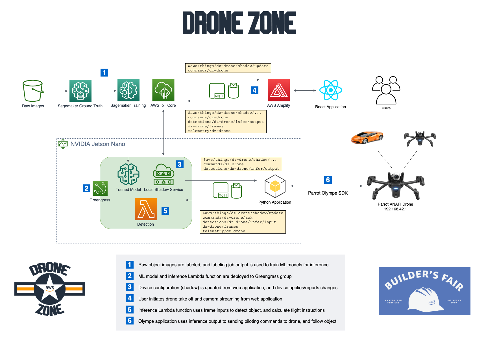

# Drone Zone #

Drone Zone is a multi-drone command and control environment powered by AWS IoT/Greengrass. Flight settings are configured with Device Shadow Service for AWS IoT, while piloting instructions are provided by a serverless Lambda function deployed to the edge. With AWS SageMaker object detection models deployed to the edge, drones can detect other drones/RC cars within its range of vision, follow these targets, and report findings back to a real time dashboard.

## AWS Services Used ##
- [Amazon CloudFront](https://aws.amazon.com/cloudfront/)
- [Amazon Cognito](https://aws.amazon.com/cognito/)
- [Amazon S3](https://aws.amazon.com/s3/)
- [Amazon SageMaker](https://aws.amazon.com/sagemaker/)
- [Amazon SageMaker Ground Truth](https://aws.amazon.com/sagemaker/groundtruth/)
- [AWS Amplify](https://aws.amazon.com/amplify/)
- [AWS IoT Core](https://aws.amazon.com/iot-core/)
- [AWS IoT Greengrass](https://aws.amazon.com/greengrass/)

## Architecture ##

## FAQ ##
__Q: What drone was used for this project?__

The [Parrot ANAFI Work](https://www.parrot.com/business-solutions-us/parrot-professional/anafi-work) drone was used for this project. This drone was selected for its configurable Wi-Fi frequency, and [Python-based Olympe controller interface](https://developer.parrot.com/docs/olympe/).

__Q: What edge/IoT device was used for this project?__

The [NVIDIA Jetson Nano Developer Kit](https://www.nvidia.com/en-us/autonomous-machines/embedded-systems/jetson-nano-developer-kit/) was used for this project. This device was primarily selected for its GPU, making it easy to run ML model predictions in near real-time.

## Authors ##
- Jon Slominski jonslo@amazon.com
- Noah Martin noahma@amazon.com
- Bryan Landes landesb@amazon.com
- Jared Warren jarewarr@amazon.com
- Aaron Curtis aaarcr@amazon.com

# License #

This library is licensed under the Apache 2.0 License.