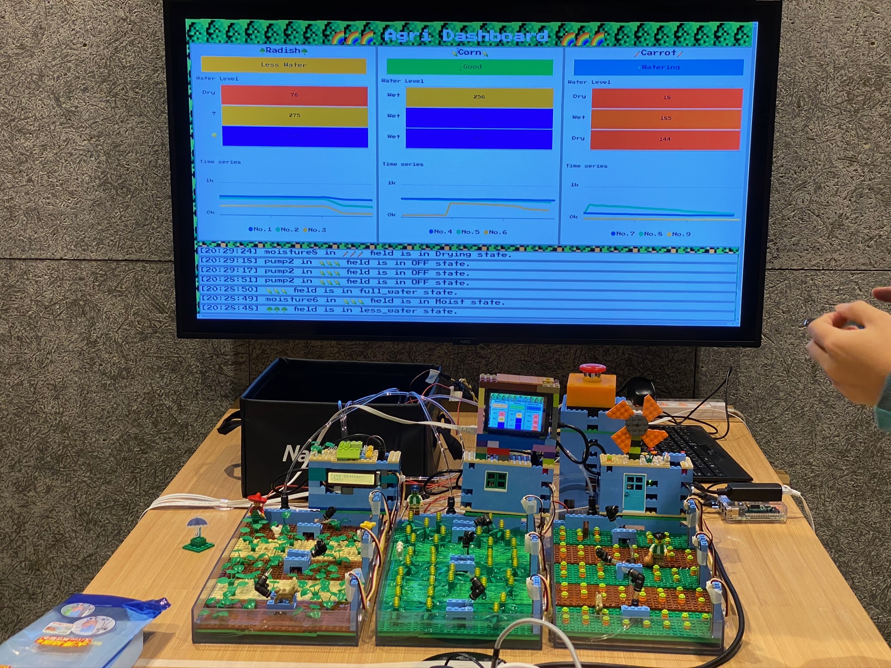
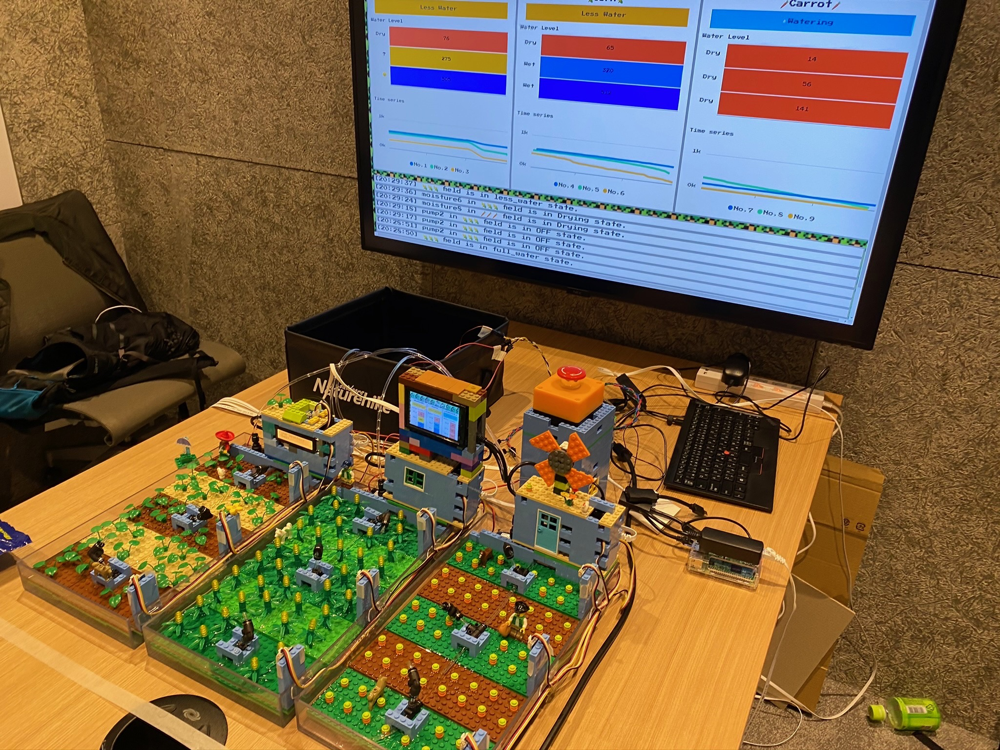
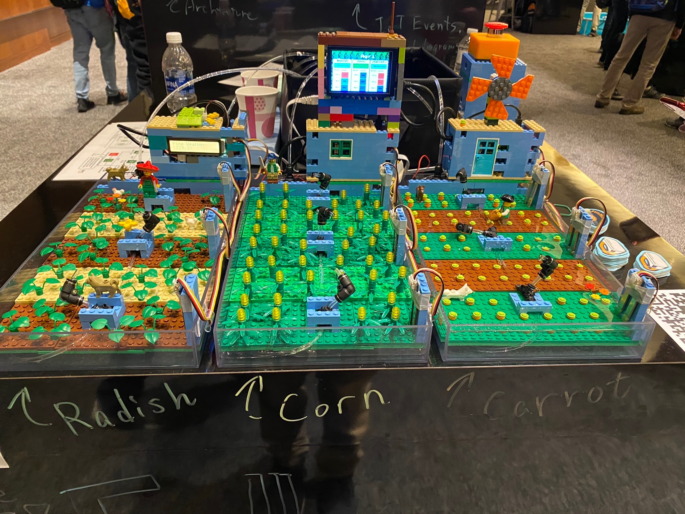
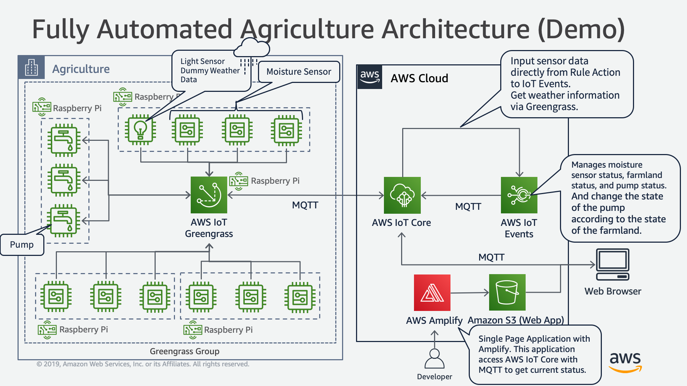
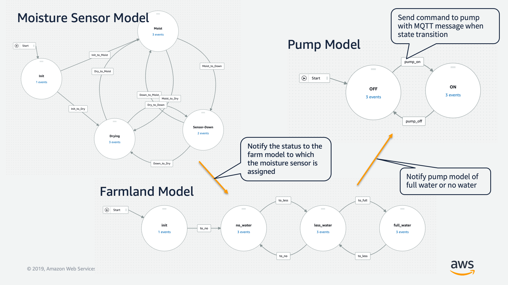

# Fully Automated Farm

## Overview
An important point in agriculture is to grow delicious crops efficiently at low cost.
In order to grow delicious crops, it is necessary to provide an optimal cultivation environment, and to provide appropriate amounts of water and nutrients at appropriate times.
Also, in order to carry out these tasks at low cost, a system for monitoring and automation is required.
In this demo, we propose a monitoring and automation solution using AWS IoT to provide an optimal cultivation environment.
By automated watering, we reduce and optimize the work load that occurs irregularly.
Furthermore, we propose a monitoring and automated system so that they can be dosed at best timing.

This demo shows fully automated watering to the fields by IoT.
Each field have several moisture sensors that constantly monitor the moisture in the soil at each location.
Therefore, if dry is observed on all the sensors of the field, the field is determined to be dry and watering is started automatically.
And watering is stopped automatically when the entire field is moisturized.
The sales-point is there is no code and database on the cloud side.
AWS IoT Events is used to control and manage devices and its state in this demo.

## Actual demo stand

## Architecture Diagram

## Models of AWS IoT Events

## BOM
[Link](./BOM.md)

## Authors
- Shota Iizuka: [iizus@amazon.co.jp](iizus@amazon.co.jp)
- Satoshi Watanabe: [watsatos@amazon.co.jp](watsatos@amazon.co.jp)
- Tatsuhiro Iida: [tatsiida@amazon.co.jp](tatsiida@amazon.co.jp)

# License
This library is licensed under the Apache 2.0 License.
