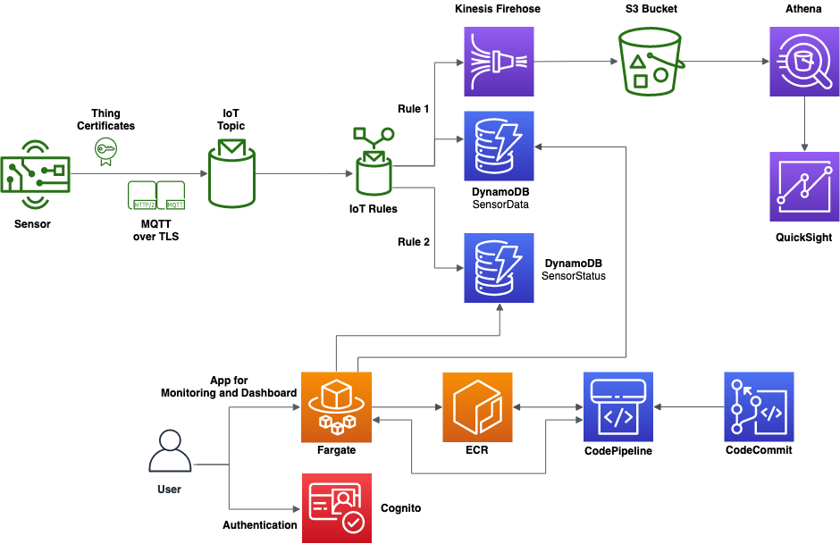

# re:Inventing Flexible Working - Hot Desks re:Imagined #

Ever looked for a spare unallocated desk at work?, ever needed an ad-hoc meeting and not able to find a room? We use a Raspberry Pi, a motion-sensor, a simple algorithm and IoT Core to try and save you the pain of seeking spare resources.

The Sensor reports the presence information to IoT Core and is logged to S3 and DynamoDB for visualisation. Using a real-time floor-map you can tell at-a-glance which desks and rooms are free.

AWS Systems Manager runs on each Raspberry Pi, enabling simple centralised command, contorl and compliance from the native Console.

> Visualisation GUI code is being cleaned-up - we hope to publish soon

## Architecture ##

## Getting Started ##

Get a Raspberry Pi and set-up with Raspian (Lite or Full). Connect the PIR motion-sensor to the board. Optionally connect the LEDs.  

Take a look at the tutorial docs and spin-up the IoT backend.  

Create a Systems Manager configuration and note the code & ID, then update the ./bin/installssm.sh script  

Modify the ./bin/app.py file to reference the correct certificates and IoT URL.  

Deploy the ./bin/ folder to a Raspberry Pi (we used /home/pi/iot/ on the PoC), along with the certificates created whilst setting-up the IoT backend (files 6b148d4216* are included for reference, but contain no key material).  

Add '@reboot sudo /home/pi/iot/start.sh' to cron (using sudo crontab -e).  

Run the (updated) ./bin/installssm.sh script to install the Systems Manager agent and register the sensor with the AWS backend.  

## Authors ##
- Ian Fayers ifayers@amazon.co.uk
- Richard Westby-Nunn rwn@amazon.co.uk
- Thiha Soe thihasoe@amazon.co.uk
- Alex Fayers alex@fayers.com

# License #

This library is licensed under the Apache 2.0 License.

