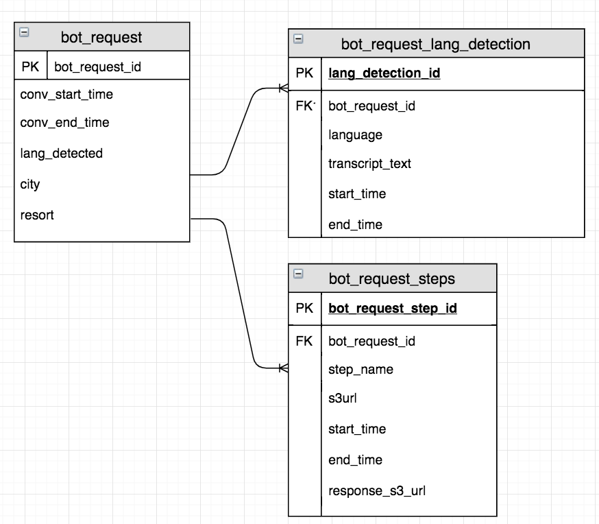

# Polygot Bot

# Project Description
A greeter bot that recognizes your greeting language and wish you back in the same language with hand gesture. Under the hood, this bot is powered based on a serverless architecture using AWS Lambda, Amazon S3, Amazon Transcribe, Amazon Translate, Amazon Polly, AWS IoT Core,
Amazon Aurora, Amazon RDS API and Amazon Quicksight.

# Attendee experience 
User will walk to the bot and greet in a language, for example “namaste” ('hello' in Hindi language), the bot will greet back in the same language with hands gesture which in this case would be hands pressed together. 

# Overview
Bot is powered by Raspberry pi and uses IoT core to communicate back and forth to AWS. Greeting from the user is captured using mic connected to Raspberry pi. Audio file containing the greeting is pushed to s3 from Raspberry pi. 

A event notification is configured on S3 to invoke a lambda function that internally transcribes the audio to all 10 languages. The lambda function uses realtime transcription for languages that support real time and submits transcribe batch jobs for landuages that do not support realtime. Once the audio file is transcribed, it checks to see if the message contains any of the greeting words. If it does, then the langauge is marked in the database and a welcome text message is translated to the identified language. The text message is sent to polly to convert it to an audio file in s3. An IoT message containing the s3 url of the audio file, and state name "greetings" is published to an IoT topic. Raspberry pi is subscribed to IoT topic and dowloads the audio file once the message is received. Downloaded message is played back to the user.The message requests user to provide the city from where they are coming.

The same flow continues as the bot asks the city of the user. The recorded audio is pushed to s3 that triggers s3 event notification that is configured to invoke a lambda function. The lambda function transcribes the audio file and invokes ["OpenWeather"](#https://openweathermap.org/) API to get the weather of the city. Message iks created based on weather information, translated, converted to audio file and sent back as IoT message that is played to the user by the bot.The message requests user to provide the hotel or casino  where they are staying in.

As the user responds with a hotel/casino name, the same flow continues. Yelp api is used to find restaurants close by the hotel/casingo. Top 5 restaurants returned by API is returned back in the message as dinner recommendations to the user. The final message also concludes with a "goodbye" to the user.

Data about the requests received and processed are captured in to Serverless Aurora database using RDS API from lambda functions. The following picture represents the ER diagram of the database model on Aurora.

### ER Diagram

The files captured from the bot and sent back to the bot are stored in s3 under following folder structure. Event notifications to trigger different lambda functions are configured based on the folder into which the file is uploaded by pi. 

- polyglotbot
 - greetings
 - city
 - hotel
 - output

### High Level Architecture

