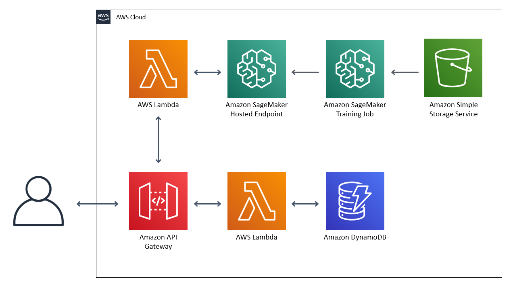

# Puente

Puente is a machine learning model that recognizes static American Sign Language letters. The model is placed behind an API to allow developers to build their different applications on without having to learn machine learning. 

## Architecture

