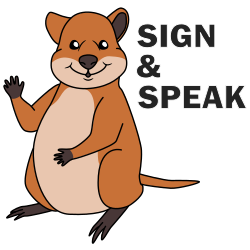
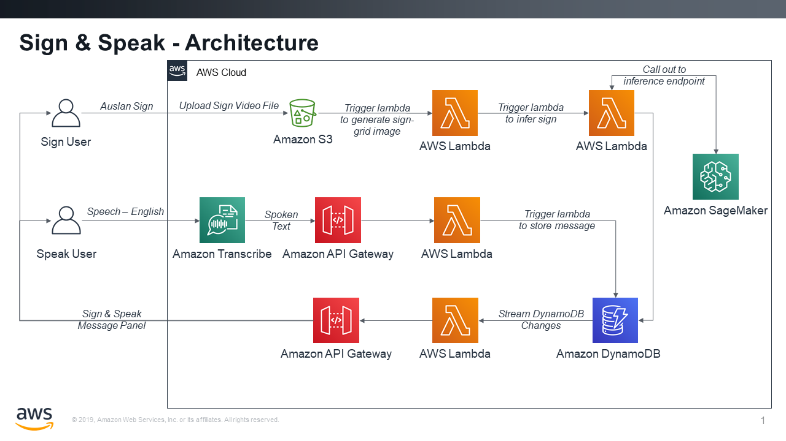

# Sign & Speak - AI-powered Communication

## 1. Project Overview

TODO

## 2. Project Abstract

Sign & Speak facilitates communication between users of spoken language and users of sign language. By applying AI models trained to transcribe speech and interpret sign language, combined with a camera and a microphone, the tool enables two-way conversation in situations where communication was previously challenging.

## 3. Participant Experience

The Sign & Speak demo allows two participants to complete two scripted conversations, where one participant uses Auslan (Australian sign language) and one participant uses English. The Auslan user stands in front of a webcam, with a white background behind them, and is shown the 'Sign' page of the UI. The English user stands in front of a directional microphone, and is shown the 'Speak' page of the UI. Both UI components allow the participants to record their interaction through start/stop buttons.

The table below shows the two scripted conversations supported in the demo, where *A* is the Auslan user and *E* is the English user.

| Conversation #1 | Conversation #2 |
| A: Hello. | A: Pleased to meet you. |
| E: Hi! How are you? | E: Likewise. How are you? |
| A: Good. How are you? | A: Good. How are you? |
| E: I'm doing well. What are you planning tonight? | E: I'm doing well. What are you up to tonight? |
| A: Going to the pub. | A: Going to a restaurant. |
| E: Oh cool, I'd love to join you. What time are you going? | |
| A: At 20:00 | E: Sound great, I'd love to join you. At what time are you going? |
| E: See you there! | A: At 20:00 |
| A: Goodbye | E: See you there! |
| | A: Goodbye |

In addition to the two-way conversation, the demo allows for individual participants to test the Auslan transcription model seperately. When testing the Auslan model, participants can choose from the following list of supported words and phrases:

* Cat
* Friend
* Grandfather
* Grandmother
* Hello
* Goodbye
* Pleased to meet you
* Good! How are you?
* Thank you
* Eight 'o clock
* Restaurant
* Pub

## 4. Architecture

TODO - describe architecture 

## 5. User Guide

This section describes how to set up the project on your own AWS account.

### 5.1 Hardware and Equipment

Below is a list of hardware and equipment used during the demo, in combination with the laptop running the demo itself.

* Webcam with USB connector
* Directional microphone with USB connector
* White canvas background + stand
* Height-adjustable tripods for webcam and microphone
* Additional monitor (*optional*)
* Softbox lighting kit (*optional*)

### 5.2 Machine Learning Model

TODO

#### 5.2.1 Creating a data set

TODO

#### 5.2.2 Training and deploying a model

TODO

### 5.3 User Interface

TODO

## 6. FAQ

TODO - Add more Q/A

**Q: There is more than one sign language?**

**A:** Yes! By some estimates there are perhaps [300 sign languages](https://en.wikipedia.org/wiki/List_of_sign_languages). Although ASL (American Sign Language) is probably the most well-known of these languages, the Sign & Speak project was built to support [Auslan](https://en.wikipedia.org/wiki/Auslan) (Australian Sign Language).

**Q: Will this method work for sign languages other than Auslan?**

**A:** We believe our method can be applied to any sign language. All you need is the training data to train a new model for the sign language of your choice. We describe our approach for collecting training data in the User Guide section of this document.

**Q: Can you share your Auslan data set and/or model?**

**A:** To protect the privacy of the volunteers who helped us build our Auslan model, we will not release the data or the model. However, with the code made available in this repository, you can train a new model on your own data.

**Q: What are the limitations of this method?**

**A:** TODO

**Q: What are the future plans for this project?**

**A:** TODO

**Q: What is the animal in your logo?**

**A:** It's a [quokka](https://duckduckgo.com/?q=quokka&t=ffnt&atb=v176-1&iax=images&ia=images), a marsupial found only in Australia. We are not professional artists. ;)

## 7. Authors

Sara 'Moose' van de Moosdijk, AWS ([GitHub](https://github.com/moose-in-australia/) | [LinkedIn](https://www.linkedin.com/in/saravandemoosdijk/))

Eshaan Anand, AWS (GitHub | LinkedIn)

## 8. License

This library is licensed under the Apache 2.0 License.