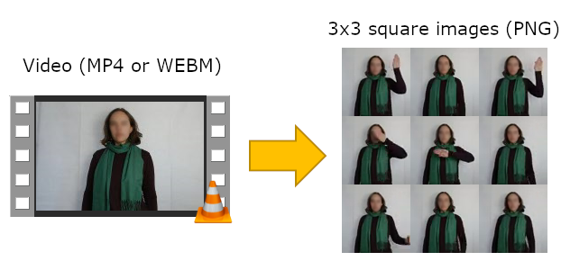

# Sign & Speak - AI-powered Communication

## 1. Project Overview

This repository provides the resources and instructions required to create your own version of the Sign & Speak project, which was on display at the Builder's Fair during re:Invent 2019. Sign & Speak uses machine learning to build a communication tool for users of sign language and users of spoken language.

## 2. Project Abstract

Sign & Speak facilitates communication between users of spoken language and users of sign language. By applying AI models trained to transcribe speech and interpret sign language, combined with a camera and a microphone, the tool enables two-way conversation in situations where communication was previously challenging.

## 3. Participant Experience

The Sign & Speak demo allows two participants to complete two scripted conversations, where one participant uses Auslan (Australian sign language) and one participant uses English. The Auslan user stands in front of a webcam, with a white background behind them, and is shown the 'Sign' page of the UI. The English user stands in front of a directional microphone, and is shown the 'Speak' page of the UI. Both UI components allow the participants to record their interaction through start/stop buttons.

The table below shows the two scripted conversations supported in the demo, where *A* is the Auslan user and *E* is the English user.

| Conversation #1 | Conversation #2 |
| ------------- | ------------- |
| **A:** Hello. | **A:** Pleased to meet you. |
| **E:** Hi! How are you? | **E:** Likewise. How are you? |
| **A:** Good. How are you? | **A:** Good. How are you? |
| **E:** I'm doing well. What are you planning tonight? | **E:** I'm doing well. What are you up to tonight? |
| **A:** Going to the pub. | **A:** Going to a restaurant. |
| **E:** Oh cool, I'd love to join you. What time are you going? | **E:** Sound great, I'd love to join you. At what time are you going? |
| **A:** At 20:00 | **A:** At 20:00 |
| **E:** See you there! | **E:** See you there! |
| **A:** Goodbye | **A:** Goodbye |

In addition to the two-way conversation, the demo allows for individual participants to test the Auslan transcription model seperately. When testing the Auslan model, participants can choose from the following list of supported words and phrases:

* Cat
* Friend
* Grandfather
* Grandmother
* Hello
* Goodbye
* Pleased to meet you
* Good! How are you?
* Thank you
* Eight 'o clock
* Restaurant
* Pub

## 4. Architecture

The image below shows the full architecture for the two-way communication demo.

### Sign Flow ###
1. A video recording is made of the Auslan user signing a word or phrase. This video is uploaded to an Amazon S3 bucket.
1. The video upload triggers an AWS Lambda function which transforms the video into an image (a grid of frames). 
1. A second AWS Lambda function sends the image to an Amazon SageMaker inference endpoint and waits for the response. It stores the resulting message in an Amazon DynamoDB table.

### Speak Flow
1. A stream of spoken words is sent to Amazon Transcribe to get a transcript.
1. This transcript is stored into the DynamoDB as a "Speech" message by a Lambda Function

### UI Flow 
- When a new Sign UI/Speak UI instance is started up, It makes a persistent connection to the Websocket API on the API Gateway
- Changes to the DynamoDB table are captured via a DynamoDB Stream and the inserted message is published to the API Gateway endpoint using another Lambda Function
- The Websocket API on the APIGateway publishes the message back to the Sign UI/ Speak UI which displays the formatted message

## 5. User Guide

This section describes how to set up the project on your own AWS account.

### 5.1 Hardware and Equipment

Below is a list of hardware and equipment used during the demo, in combination with the laptop running the demo itself.

* Webcam with USB connector
* Directional microphone with USB connector
* White canvas background + stand
* Height-adjustable tripods for webcam and microphone
* Additional monitor (*optional*)
* Softbox lighting kit (*optional*)

### 5.2 Machine Learning Model

The sign language machine learning model is created using [PyTorch](https://pytorch.org/) in [Amazon SageMaker](https://aws.amazon.com/sagemaker/). This section describes the process of training a new model from scratch.

#### 5.2.1 Creating a data set

First, you need to decide on a set of words and short phrases which the demo should support. We used the list of 12 words and phrases listed in section 3. The model performs better on signs which are visually distinct, but with enough training data, it can distinguish between similar signs such as grandfather and grandmother.

Second, you need to determine the audience for your demo. At re:Invent, we expected to see adult participants, with no prior knowledge of Auslan, and various nationalities, genders, clothing styles, and other visual features. To create a robust model for our expected audience, we asked 64 colleagues from different AWS offices to help us create training data. 

We controlled for factors such as background and lighting by choosing to only support a white background with even lighting. After completing the recording sessions with volunteers, and discarding unsuitable recordings, we were left with 42-72 videos per word or phrase. 

#### 5.2.2. Video preprocessing

Each video recording of a word or phrase is transformed into an image representation for the purpose of performing image classification with the machine learning model. This processing is done through a combination of Bash and Python scripts executed by AWS Lambda. This section explains how the preprocessing generates an image from a video, and describes how to set up your own AWS Lambda function to support the process.

To capture the movement (or time) element of signing a word or phrase, the image representation of a video is created as a 3x3 grid of video frames. [FFmpeg](https://ffmpeg.org/) is used to extract the key (non-blurry) frames from the video, then a Python script selects 9 key frames evenly spread across the length of the video, and FFmpeg is used to arrange these frames into the final grid structure. By selecting the frames according to the length of the video, this method is more robust to different speeds of signing. The image below illustrates the concept (blurred for anonymization only). 

#### 5.2.3 Training and deploying a model

First, ensure that all training videos have been preprocessed into 3x3 grid images. Upload these images to an Amazon S3 bucket, organizing the images into folders based on their label (e.g. a folder for 'cat', a folder for 'pub', etc).

Follow [these instructions](https://docs.aws.amazon.com/sagemaker/latest/dg/gs-setup-working-env.html) to set up an Amazon SageMaker instance on the smallest instance type (`ml.t3.medium`). If you want to pre-load the Sign & Speak scripts, simply add the URL to this GitHub repository in the 'Git repositories' section of the setup process. 

If you forgot to pre-load the Sign & Speak project, simply wait for the instance to show status `InService`, then click 'Open Jupyter'. In the new tab which opens, click on the 'New' drop-down menu in the top right corner, and choose 'Terminal' at the bottom of the list. From the terminal, you can `git clone` this repository onto the instance.

### 5.3 Sign & Speak User Interface

There are two key screens in the UI - a Sign UI and a Speak UI. Each of them is meant to allow the user to interact with the demo and get a 2-way conversation going. 

Each of the UI will support 4 key functions

- **On load** : Connect to WebSocket API
- **On unload** : Disconnect from WebSocket API
- **Receive Message** : On receiving a message from the WebSocket API, update the Text Chat panel
- **Capture Intent** : Capture the intent of the user (e.g. capture user video in a Sign UI / capture spoken words from Speak UI)

#### 5.3.1 Sign UI
The UI has two panels - Sign Panel and a Message Panel

**Sign Panel**
- Start Sign Button > Starts recording the sign being performed by the user
- Stop Sign Button > Stops recording 
- Upload Sign Button > Uploads the recorded video to S3

**Message Panel**
- Receive Message > Format the message and display in the Message Panel with a caption "Auslan"

#### 5.3.2 Speak UI
**Speak Panel**
- Start Speaking > Starts capturing spoken words and stream to Amazon Transcribe endpoint
- Stop Speaking > Stops capturing spoken words and stop streaming to Amazon Transcribe endpoint
- Send Message > Sends the transcript of spoken text to an API Gateway endpoint, that saves it to the DynamoDB table using a Lambda function

**Message Panel**
- Receive Message > Format the message and display in the Message Panel with a caption "English"

**NOTE** : We have not uploaded the codes for the Speak UI, it follows the same behaviour seen at [aws-samples/amazon-transcribe-websocket-static](https://github.com/aws-samples/amazon-transcribe-websocket-static)

## 6. Setup Instructions

### 6.0 Pre-Setup

**Setup the FFMPEG Lambda Layer**
The stable release of FFmpeg at time of writing (4.2.1) does not contain all the features required to complete the preprocessing. We recommend downloading a [nightly build](https://johnvansickle.com/ffmpeg/) to access the latest features and bug fixes. We used the build from 26/08/2019, but would expect any later build or release to support the required functionality.

The video preprocessing code is included in this repository and should be placed in an [AWS Lambda](https://aws.amazon.com/lambda/) function running Python 3.8. To run the correct version of FFmpeg, you need to upload it as an [AWS Lambda layer](https://docs.aws.amazon.com/lambda/latest/dg/configuration-layers.html). Keep in mind the [size limits](https://docs.aws.amazon.com/lambda/latest/dg/limits.html) for AWS Lambda - only the main ffmpeg binary needs to be included in the ZIP package uploaded as a Lambda layer.

**Setup the Machine Learning model for inference** 
Follow the instructions in `scripts/ML Instructions.ipynb` to train and deploy a model with your training data. Once you have an Amazon SageMaker endpoint, follow the instructions below to connect it to the UI.

### 6.1 Installation

Please follow the below steps after downloading the code to setup

**[AWS] Setup the AWS Resources**
- Run the CloudFormation template at /CloudFormation/cf.json. (Note: This template has been tested in AWS Sydney region only)
    - Give the name of the stack as "S2SAPP"
    - Provide the parameters requested
        - PARAMFFMPEGLayer : ARN with version of the FFMPEG Layer
        - PARAMS2SEndpoint : URL of the S2S Model on Sagemaker

**[AWS] IAM User with AccessKey**
- Go to IAM User "s2sclientuser" in IAM Console 
    - Click on the tab "Security Credentials"
    - Click on "Create Access Key"
    - Copy and Store the Access key ID/Secret access key, securely 

**[AWS] Lambda Functions : Update latest code**
- Copy the updated code for lambda functions. Create the files as necessary 
    - infersign-cf ( index.py )
    - python-video-to-grid-shell-cf( index.py , frame_picker.py , testscript.sh , video_to_grid.sh )
    - s2s-ws-connect-cf( index.py )
    - s2s-ws-disconnect-cf( index.py )
    - s2s-ws-sendmessage-node-cf ( index.js )

**[AWS] Update Lambda Trigger : python-video-to-grid-shell-cf**
- Open the Lambda Function python-video-to-grid-shell
    - Click on Runtime dropdown, and select "Python3.8"
    - Click on Add Trigger
    - Trigger Configration: select S3
    - Bucket: signs-data-cf
    - Event Type : "All object create events"
    - Prefix : "02_app/upload/"
    - Ensure "Enable Trigger" is checked
    - Click Add
    
**[AWS] Update Lambda Trigger : infersign-cf**
- Open the Lambda Function infersign
    - Click on Add Trigger
    - Trigger Configration: select S3
    - Bucket: signs-data-cf
    - Event Type : "All object create events"
    - Prefix : "02_app/grid-image/"
    - Ensure "Enable Trigger" is checked
    - Click Add

**[LocalMachine] S2S Client UI**
- Copy the ui folder to a local directory

**[LocalMachine] Update [LocalDir]\ui\static\js\sign.js**
- Update the app_credentials
    - Put the AccessKeyID/SecretAccessKey in app_credentials
- Set the region
    - Update the variable "app_region" based on the AWS Region used

**[LocalMachine] Update [LocalDir]\ui\static\js\web-socket-msg.js**
- Update the WS URL
    - Put the CloudFormation Template Output value for S2SWebSocketURL in  "wsurl" variable

### 6.3 Run Application
*Use Firefox (We have tested it only on this browser)*
- Navigate to the page \ui\sign.html
- Click on Start Sign/Stop Sign to record a sign
- Click on Upload Sign to trigger the process of inference
- Inferred sign message is displayed on the UI
- If you get an alert message "WebSocket connection is closed. Refresh screen!!!", then reload your UI.

### 6.4 Uninstall

**[AWS] Before Deleting the CloudFormation Stack**
- Make sure the S3 Bucket "signs-data-cf" is empty before deleting the Stack, otherwise it will fail.
    - Delete the Cloudformation stack - "S2SAPP"

## 7. FAQ

**Q: There is more than one sign language?**

**A:** Yes! By some estimates there are perhaps [300 sign languages](https://en.wikipedia.org/wiki/List_of_sign_languages). Although ASL (American Sign Language) is probably the most well-known of these languages, the Sign & Speak project was built to support [Auslan](https://en.wikipedia.org/wiki/Auslan) (Australian Sign Language).

**Q: Will this method work for sign languages other than Auslan?**

**A:** We believe our method can be applied to any sign language. All you need is the training data to train a new model for the sign language of your choice. We describe our approach for collecting training data in the User Guide section of this document.

**Q: Can you share your Auslan data set and/or model?**

**A:** To protect the privacy of the volunteers who helped us build our Auslan model, we will not release the data or the model. However, with the code made available in this repository, you can train a new model on your own data.

**Q: What are the limitations of this method?**

**A:** The method only works for individual signs, or short combinations of signs (e.g. 'pleased to meet you' consists of three signs). Due to the limit of 9 frames it will not support full sentences. Additionally, the demo performed well with 12 different labels, but would require significantly more training data to scale to larger numbers of supported labels. Finally, this method does not capture all the nuances of sign language, such as expression and context. 

**Q:What platform has the UI been tested on?**

**A:** The UI has been tested to work on Windows 10, with Mozilla Firefox browser. It's tested to work in the AWS Sydney Region.

**Q:** I only see a rotating circle on the UI! Help!

**A:** Check the following steps have been performed correctly:
- Verify that all the lambda function code has been updated correctly
- Verify that the S3 Bucket triggers for inferSign-cf and python-video-to-grid-shell-cf are created 
- Verify that you have changed the runtime language of lambda function python-video-to-grid-shell-cf to Python 3.8
- Check CloudWatch logs for the lambda functions for errors

**Q: What are the future plans for this project?**

**A:** There are many ideas for improving and extending this project; below is a short, but incomplete list.
* Add support for full sign language sentences
* Add support for continuous sign language recognition
* Add a 3D avatar to turn text into sign language
* Improve the security of the application (e.g. Build in Authentication for UI and APIs)

**Q: What is the animal in your logo?**

**A:** It's a [quokka](https://duckduckgo.com/?q=quokka&t=ffnt&atb=v176-1&iax=images&ia=images), a marsupial found only in Australia. We are not professional artists. ;)

## 8. Authors

Sara 'Moose' van de Moosdijk, AWS ([GitHub](https://github.com/moose-in-australia/) | [LinkedIn](https://www.linkedin.com/in/saravandemoosdijk/))

Eshaan Anand, AWS ([GitHub](https://github.com/ea-coder) | [LinkedIn](https://sg.linkedin.com/in/eshaan-anand))

## 9. License

This library is licensed under the Apache 2.0 License.

## 10. References

This project references the following libraries to put together the solution:

- [jquery-1.12.4](https://jquery.com/)
- [aws-sdk.min.js](https://cdnjs.cloudflare.com/ajax/libs/aws-sdk/2.610.0/aws-sdk.min.js)
- [bootstrap](https://getbootstrap.com/)
- [RecordRTC.js](https://github.com/muaz-khan/RecordRTC)
- [adapter-latest.js](https://github.com/webrtc/adapter)
- [ffmpeg](https://ffmpeg.org/)