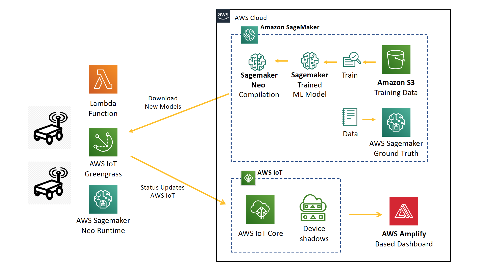

# Clash of the Soccer Bots

## Overview ##

Clash of the Soccer Bots powered by Amazon Sagemaker

In this demo, you will see 2 soccer bots (NVidia Jetson Nanos) clash with each other and fight for a soccer ball. The bots are smart enough to find, chase and strike the ball and compete with the other to see who scores the max number of strikes. The bots come to life using a mix of AWS services like Amazon Sagemaker, AWS Greengrass and AWS IoT Core.

This project has the following core components:

- Amazon Sagemaker Ground Truth for annotating data for custom model training
- Amazon Sagemaker for ML Model Training
- Amazon Sagemaker Neo for optimising model and compiling
- AWS IoT Greengrass for edge deployment
- AWS IoT Core for pub/sub updates to the cloud
- AWS Amplify for real-time dashboard to track state

## Architecture ##

Have fun!

## Authors ##

- Arun Balaji arunbal@amazon.com
- Ananth Balasubramanyam baananth@amazon.com 

