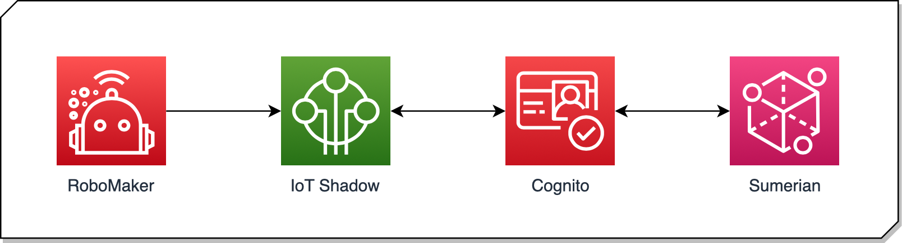

# Walking Robot #

Learning to walk takes time and a practise for humans to do naturally. It means the ability to stand upright and balanced, then the actions of locomotion and failing and then trying again until we get it right.

Building a robot to do the same is even harder. We have to design the limbs and motors, build a perception system so is understand balance and more importantly we need to use re-enforcement learning, so that it keeps on trying even when it falls.

AWS now has the tools to create such a robot. We use AWS RoboMaker to design, simulate and then help build a physical limbs and motors, we then use Sagemaker to help learn balance and then IoT to control and use feedback of real-world measurements to compare with the simulated data. 

Amazon Sumerian provides a way to create interactive graphical user interfaces to simulate, observe and control the robot. Since it is connected via AWS IoT Shadow to the robot, it does not matter if you are right next to it or miles away.

## AWS Services Used ##
- [AWS IoT Core](https://aws.amazon.com/iot-core/)
- [Amazon Sumerian](https://aws.amazon.com/sumerian/)
- [AWS RoboMaker](https://aws.amazon.com/robomaker/)
- [Amazon Cognito](https://aws.amazon.com/cognito/)

## Architecture ##

## FAQ ##
__Q: Where can I get the Robot Legs?__

...

__Q: What edge/IoT device was used for this project?__

...

## Authors ##
- Munir Hasan munhasan@amazon.co.uk
- Heiko Ihde ihdeheik@amazon.de

# License #

This content is licensed under the Apache 2.0 License.
