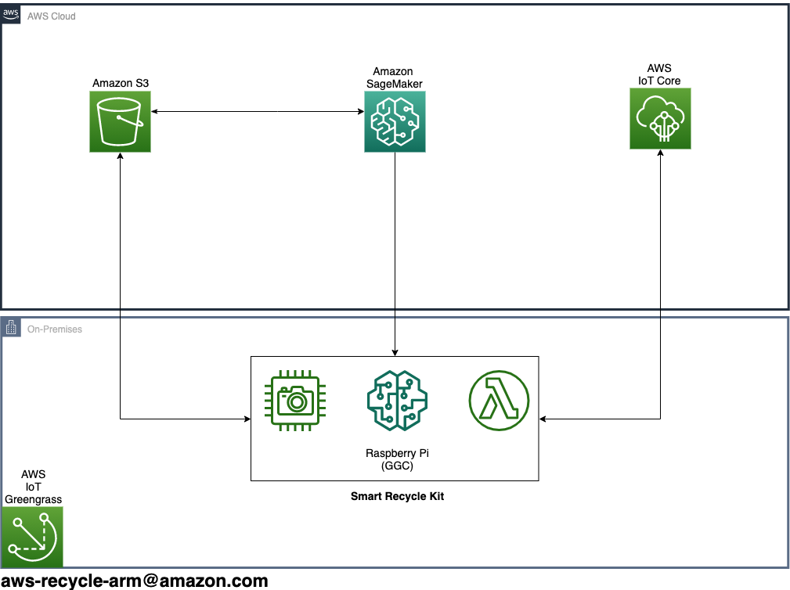

# Smart Recycle Kit

## Components needed to build Smart Recycle Kit
[Amazon Shopping List](https://www.amazon.com/hz/wishlist/ls/23FOJ731YT9VW?ref_=wl_share) created with items below. 

* [Raspberry Pi 4](https://www.amazon.com/Raspberry-Model-2019-Quad-Bluetooth/dp/B07TC2BK1X/ref=sr_1_1)
* [Raspberry Pi USB C Power Supply](https://www.amazon.com/CanaKit-Raspberry-Power-Supply-USB-C/dp/B07TYQRXTK/)
* [microSD Memory Card](https://www.amazon.com/Samsung-MicroSDHC-Adapter-MB-ME32GA-AM/dp/B06XWN9Q99/)
* [Raspberry Pi Camera](https://www.amazon.com/Raspberry-Pi-Camera-Module-Megapixel/dp/B01ER2SKFS/ref=sxts_sxwds-bia-wc-drs2_0)
* [SenseHAT](https://www.amazon.com/RASPBERRY-PI-RASPBERRYPI-SENSEHAT-Raspberry-Orientation-Temperature/dp/B014HDG74S/ref=sr_1_5)
* [MicroSD USB Card Reader](https://www.amazon.com/SanDisk-MobileMate-microSD-Card-Reader/dp/B07G5JV2B5)
* [MicroHDMI to HDMI Cable for Video](https://www.amazon.com/AmazonBasics-Flexible-Micro-Cable-6-Foot/dp/B07KSDB25X)
* USB Keyboard
* USB Mouse
* HDMI Monitor
* [Raspberry Pi Case](https://www.amazon.com/gp/product/B07X5Y81C6/ref=ppx_yo_dt_b_asin_title_o02_s00) - Optional
* [Raspberry Pi Camera Stand](https://www.amazon.com/Makeronics-Acrylic-Holder-Raspberry-Transparent/dp/B07SQL2RNR/ref=sr_1_4) - Optional

## Create your own Machine Learning Model (Optional)
Follow the instructions found [here](ml/README.md) to create your own ML model.

## Smart Recycle Kit Setup
Follow the instructions found [here](pi/README.md) to setup your Raspberry Pi to serve as a Smart Recycle Kit.