# Rasberry Pi Setup Guide
Follow the steps below to setup and configure a Raspberry Pi 4 with a SenseHat and Camera for the Smart Recycle Kit

## Setting up a Raspberry Pi for the first time

If you are setting up a Raspberry Pi for the first time, you must follow all of these steps. Otherwise, you can skip to step 8. However, we recommend that you re-image your Raspberry Pi and follow these instructions.

1. Download and install an SD card formatter such as [SD Memory Card Formatter](https://www.sdcard.org/downloads/formatter_4/index.html) or [PiBakery](http://www.pibakery.org/download.html). Insert the SD card into your computer. Start the program and choose the drive where you have inserted your SD card. You can perform a quick format of the SD card.

1. Download the [Raspbian Buster](https://downloads.raspberrypi.org/raspbian/images/raspbian-2020-02-14/) operating system as a zip file.

1. Using an SD card-writing tool (such as [Etcher](https://etcher.io/)), follow the tool's instructions to flash the downloaded zip file onto the SD card. Because the operating system image is large, this step might take some time. Eject your SD card from your computer, and insert the microSD card into your Raspberry Pi.

1. For the first boot, we recommend that you connect the Raspberry Pi to a monitor (through HDMI), a keyboard, and a mouse. Next, connect your Pi to a USB-C power source and the Raspbian operating system should start up.

    1. When prompted with "Welcome to Raspberry Pi", Press **Next**.
    
        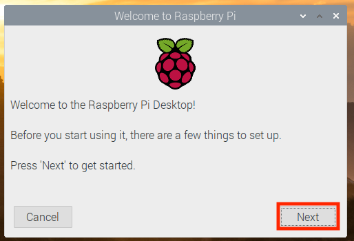
    
    1. Set Country, Language, and Timezone and Press **Next**.

        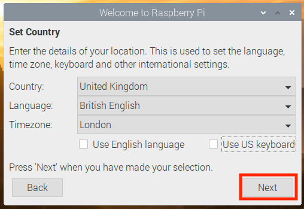
    
    1. Change the default 'pi' password and Press **Next**.

        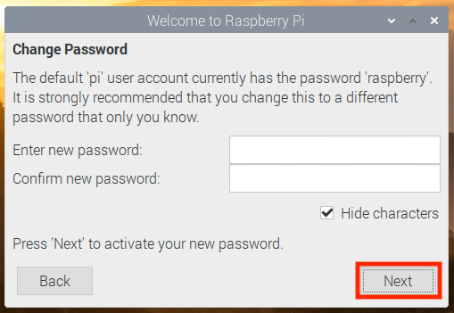
    
    1. Do you see a black border around your screen?  If so chaeck the box and Press **Next** to save the setting.

        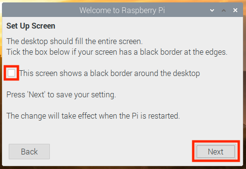
    
    1. Select your WiFi Network and Press **Next**.

        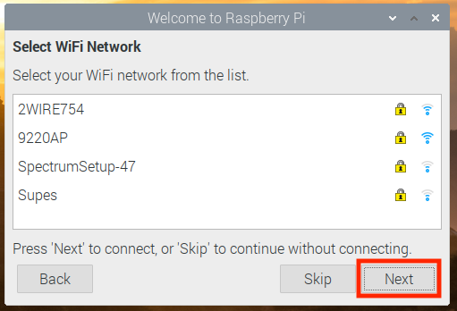
    
    1. Enter your WiFi Network Password and Press **Next**.

        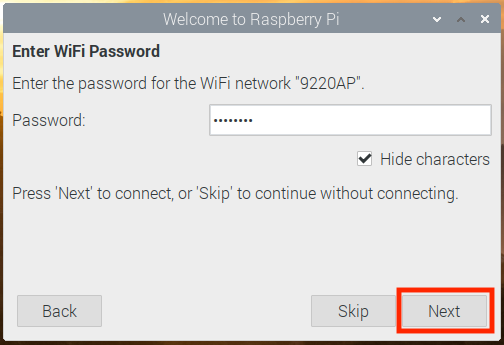
    
    1. The Raspberry Pi software will be updated in a later step, so when prompted with Update Software Press **Skip**.

        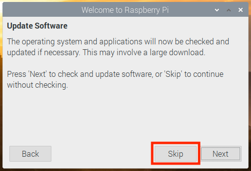
    
    1. There are a few more settings that need to be updated, so Press **Later** when prompted to 'Restart'.

        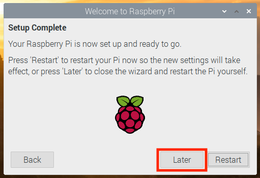
    
    1. Open "Raspberry Pi Configuration" by **Selecting** the Raspberry Menu Button in the upper left corner. The **Select** "Preferences", then **Selecting** Raspberry Pi Configuration.

        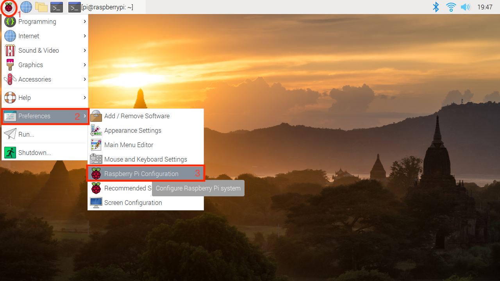

        1. Select the **Interfaces** tab.

            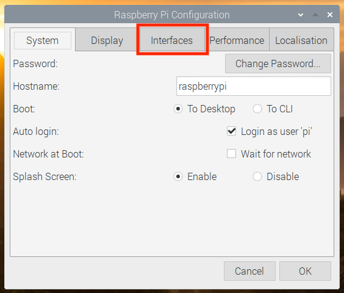

        1. Select the **Enable** Radio buttons for **Camera** and **SSH** to enable these Interfaces.

            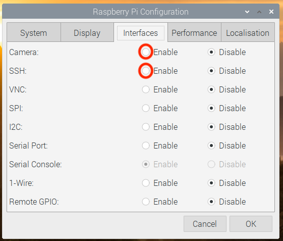

        1. Press **OK** to save the changes.

            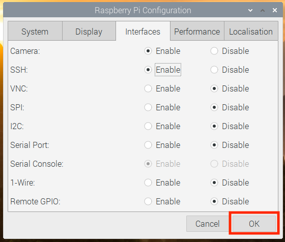

        1. Since there is one more piece of information we need to get, press **No** to "Would you like to Reboot Now?".

            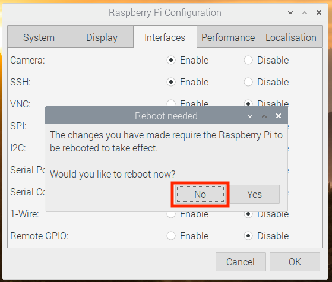
    
    1. Open a terminal window and enter the command `hostname -I` to return the IP Address of the Raspberry Pi.  Make a note of this IP Address as this will be used later to SSH to the Raspberry Pi.

        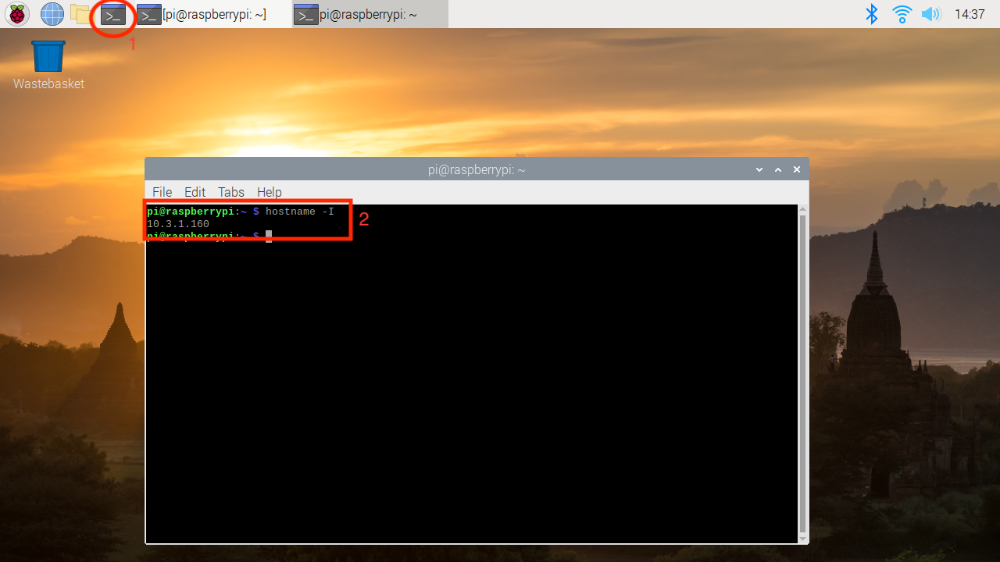

    1. Now that all of the initial configuration steps have been performed on the Raspberry Pi, it is time to reboot the Raspberry Pi.  Type `sudo reboot` in the terminal window.

        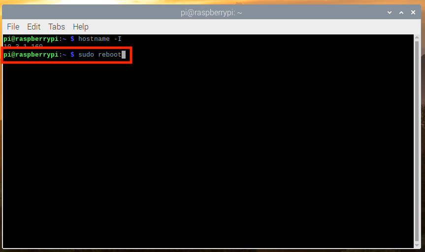

1. Once the Raspberry Pi finishes rebooting, connect using SSH to the IP Address returned from the `hostname -I` command.

    1. If you are using MacOS, open a terminal window and enter the following:

        ```bash

        ssh pi@IP-address
        
        ```

    1. If you are using Windows, you need to install and configure [PuTTY](https://www.chiark.greenend.org.uk/~sgtatham/putty/latest.html) using the MSI to install all utilities since we will use pscp later to copy files to the Raspberry Pi. Expand Connection, choose Data, and make sure that Prompt is selected:

       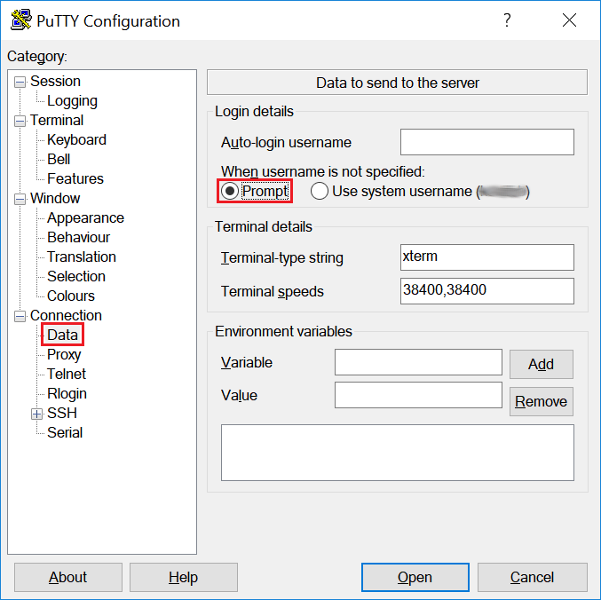

    1. Next, choose **Session**, enter the IP address of the Raspberry Pi, and then choose **Open** using default settings.

       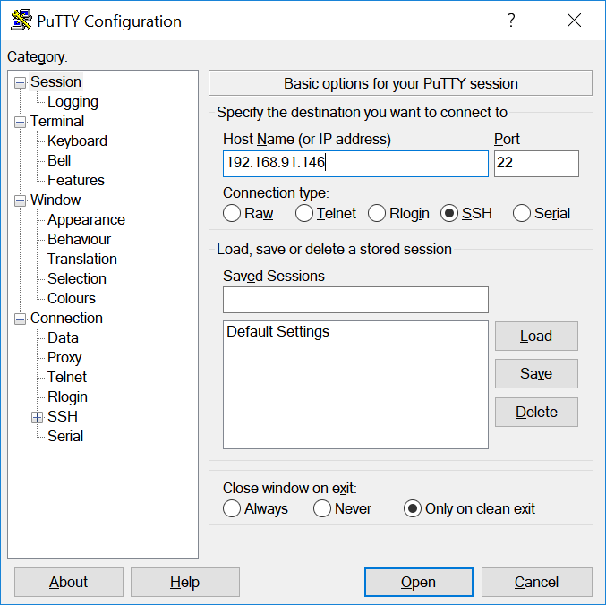

    1. If a PuTTY security alert is displayed, choose Yes.  The default Raspberry Pi login is `pi` and use the password specified earlier.

       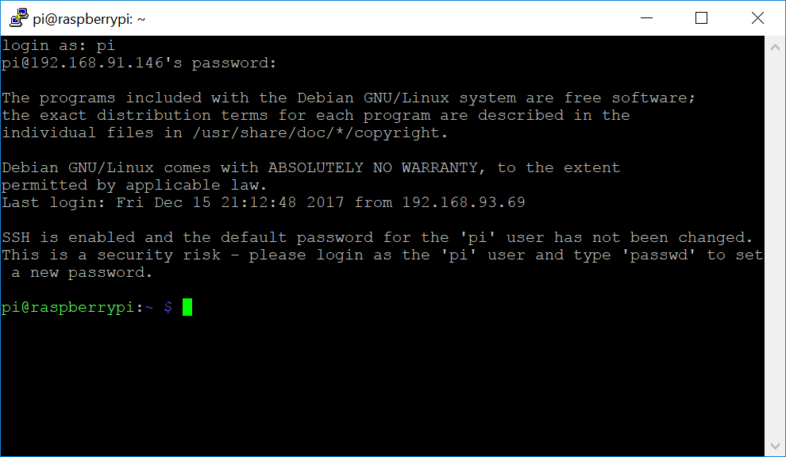

1. Using the SSH connection established above, we will upgrade the software on the Raspberry Pi by entering the two commands below.  This step will take some time to complete.

    ```bash

    sudo apt update
    
    sudo apt -y upgrade    
    
    ```

1. Once the upgrades are done, reboot the Raspberry Pi. You will be able to reconnect using SSH in about a minute.
    ```bash

    sudo reboot
    
    ```
1. You are now ready to set up the Raspberry Pi for AWS IoT Greengrass. First, run the following commands from a local Raspberry Pi terminal window or an SSH terminal window:
    ```bash

    sudo adduser --system ggc_user
    sudo addgroup --system ggc_group

    ```
1. To improve security on the Pi device, enable hardlink and softlink (symlink) protection on the operating system at startup.

    1. Navigate to the `98-rpi.conf` file.

        ```bash

        cd /etc/sysctl.d
        ls
    
        ```

    1. Use a text editor (such as Leafpad, GNU nano, or vi) to add the following two lines to the end of the file. You might need to use the sudo  command to edit as root (for example, `sudo nano 98-rpi.conf`).

        ```bash

        fs.protected_hardlinks = 1
        fs.protected_symlinks = 1  
        ```
    
    1. Reboot the Raspberry Pi.
        ```bash

        sudo reboot
    
        ```
        
        After about a minute, connect to the Pi using SSH and then run the following command to confirm the change:
    
        ```bash

        sudo sysctl -a 2> /dev/null | grep fs.protected

        ```

        You should see `fs.protected_hardlinks = 1` and `fs.protected_symlinks = 1`.

1. Edit your command line boot file to enable and mount memory cgroups. This allows AWS IoT Greengrass to set the memory limit for Lambda functions. Cgroups are also required to run AWS IoT Greengrass in the default [containerization](https://docs.aws.amazon.com/greengrass/latest/developerguide/lambda-group-config.html#lambda-containerization-considerations) mode.
    1. Navigate to your boot directory.
    ```bash

    cd /boot/

    ```

    1. Use a text editor to open `cmdline.txt`. Append the following to the end of the existing line, not as a new line. You might need to use the sudo command to edit as root (for example, `sudo nano cmdline.txt`).
    ``` bash

    cgroup_enable=memory cgroup_memory=1

    ```

   1. Reboot the Raspberry Pi.
    ```bash

    sudo reboot
    
    ```
    Your Raspberry Pi should now be ready for AWS IoT Greengrass.

1. To make sure that you have all required dependencies, reconnect to the Raspberry Pi, download and run the Greengrass dependency checker from the [AWS IoT Greengrass Samples](https://github.com/aws-samples/aws-greengrass-samples) repository on GitHub. These commands unzip and run the dependency checker script in the Downloads directory.

    ```bash
    cd /home/pi/Downloads
    mkdir greengrass-dependency-checker-GGCv1.11.x
    cd greengrass-dependency-checker-GGCv1.11.x
    wget https://github.com/aws-samples/aws-greengrass-samples/raw/master/greengrass-dependency-checker-GGCv1.11.x.zip
    unzip greengrass-dependency-checker-GGCv1.11.x.zip
    cd greengrass-dependency-checker-GGCv1.11.x
    sudo modprobe configs
    sudo ./check_ggc_dependencies | more
    ```

Where `more` appears, press the Spacebar key to display another screen of text.


## Configure AWS IoT Greengrass on AWS IoT

1. Sign in to the [AWS Management Console](https://console.aws.amazon.com/) on your computer and open **IoT Core**.

    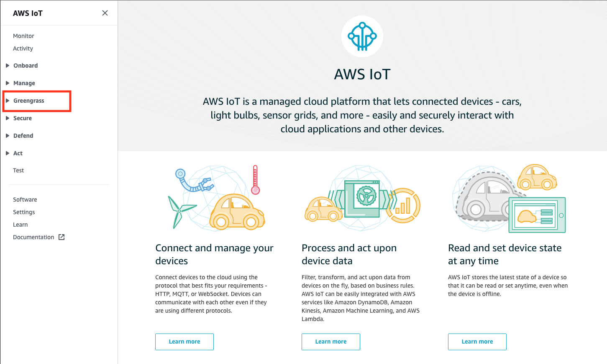

1. In the navigation pane, Expand **Greengrass**, and select **Intro**.

    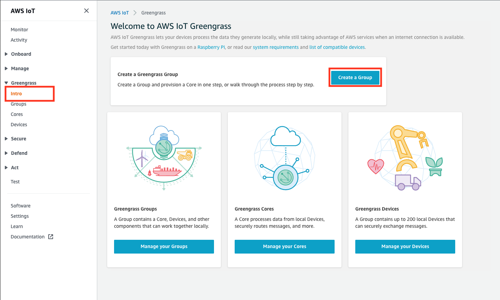

1. Select **Create a Group**.

    An AWS IoT Greengrass [group](https://docs.aws.amazon.com/greengrass/latest/developerguide/what-is-gg.html#gg-group) contains settings and other information about its components, such as devices, Lambda functions, and connectors. A group defines how its components can interact with each other.

1. If prompted, on the Greengrass needs your permission to access other services dialog box, choose Grant permission to allow the console to create or configure the Greengrass service role for you. You must use a service role to authorize AWS IoT Greengrass to access other AWS services on your behalf. Otherwise, deployments fail.

    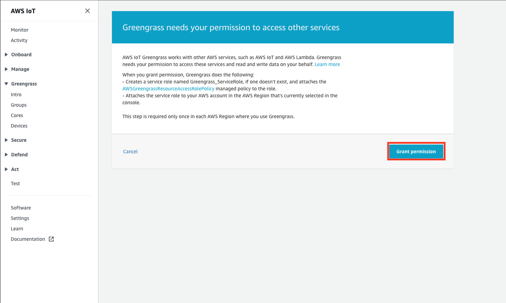

    The AWS account you used to sign in must have permissions to create or manage the IAM role. For more information, see [Greengrass service role](https://docs.aws.amazon.com/greengrass/latest/developerguide/service-role.html).

1. On the **Set up your Greengrass group** page, choose **Use default creation** to create a group and an AWS IoT Greengrass core.

    Each group requires a core, which is a device that manages local IoT processes. A core needs a certificate and keys that allow it to access AWS IoT and an [AWS IoT policy](https://docs.aws.amazon.com/iot/latest/developerguide/iot-policies.html) that allows it to perform AWS IoT and AWS IoT Greengrass actions. When you choose the Use default creation option, these security resources are created for you and the core is provisioned in the AWS IoT registry.

    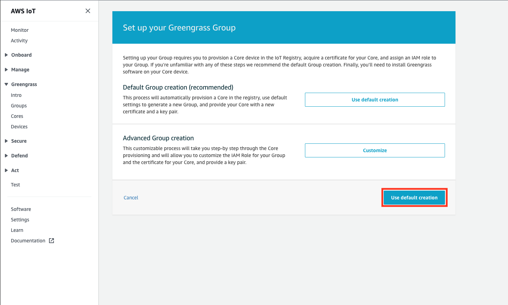

1. Enter a name for your group (for example, `recyclekit`), and then choose **Next**.

    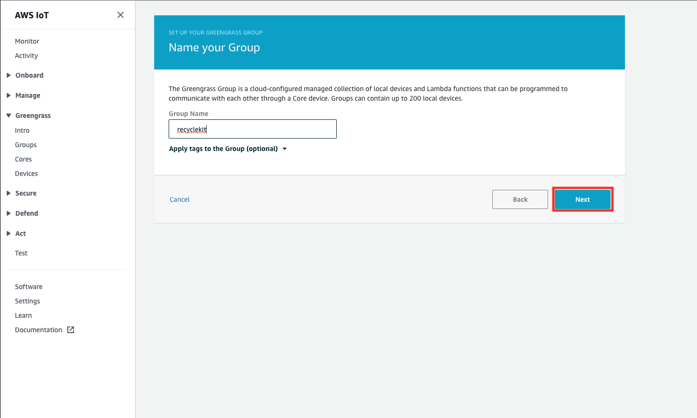

1. Use the default name for the AWS IoT Greengrass core, and then choose **Next**.

    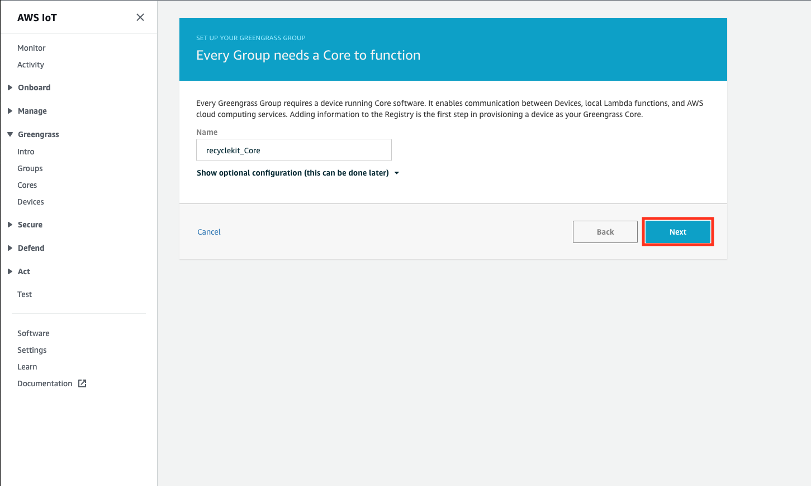

1. On the **Review Group creation** page, choose **Create Group and Core**.

    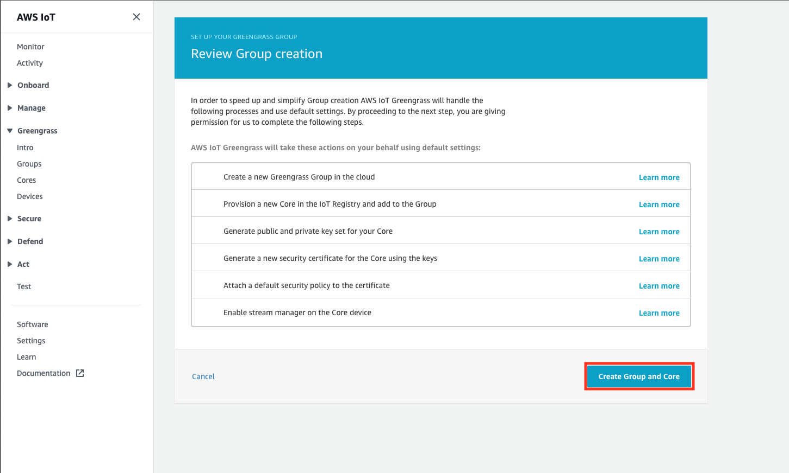

    AWS IoT creates an AWS IoT Greengrass group with default security policies and configuration files for you to load onto your device.

1. Download your core's security resources and configuration file.

    1. On the confirmation page, under **Download and store your Core's security resources**, choose **Download these resources as a tar.gz**. The name of your downloaded tar.gz file starts with a 10-digit hash that's also used for the certificate and key file names.

        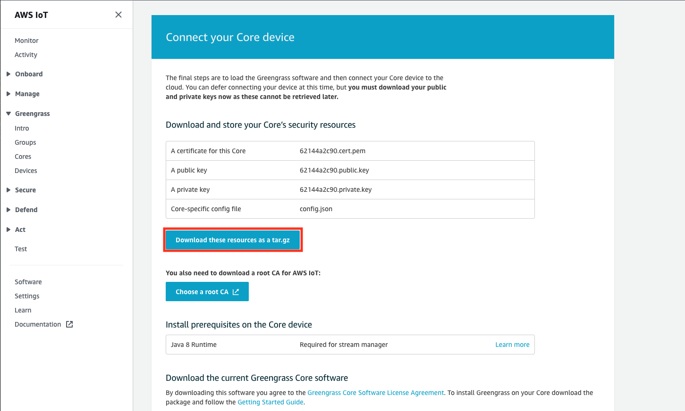

    1. Skip **Choose a root CA** for now. The next section includes a step where you download the root CA certificate.

1. After you download the security resources, choose **Finish**.

    The group configuration page displays in the console:

    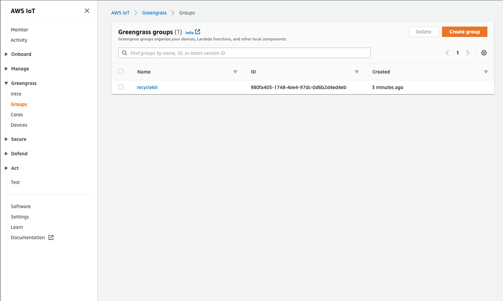

1. From the [AWS IoT Greengrass Core software](https://docs.aws.amazon.com/greengrass/latest/developerguide/what-is-gg.html#gg-core-download-tab) section in this guide, download the appropriate software installation package.  The image below shows the link for the Raspberry Pi 4. Click on this **Download** link and save the package.

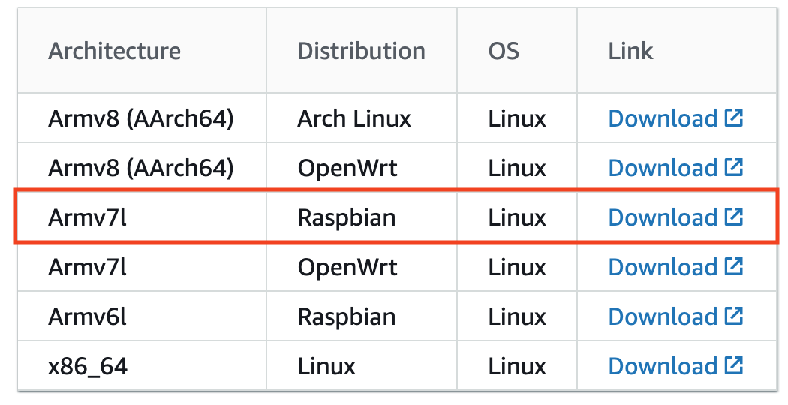


## Start AWS IoT Greengrass on the Core Device

In the previous steps, you downloaded two files to your computer:

- `hash-setup.tar.gz` (for example, `c6973960cc-setup.tar.gz`). This compressed file contains the core device certificate and cryptographic keys that enable secure communications between AWS IoT Core and the config.json file that contains configuration information specific to your Greengrass core. This information includes the location of certificate files and the AWS IoT Core endpoint.

- `greengrass-OS-architecture-1.11.0.tar.gz` (for Raspberry Pi 4, `greengrass-linux-armv7l-1.11.0.tar.gz`). This compressed file contains the AWS IoT Greengrass Core software that runs on the core device.

1. Transfer the two compressed files from your computer to the Greengrass core device. Choose your operating system for steps that show how to transfer files to your Raspberry Pi device. 

    ### MacOS
    - To transfer the compressed files from your Mac to a Raspberry Pi core device, open a Terminal window on your computer and run the following commands. The `path-to-downloaded-files` is typically `~/Downloads`.

        ```bash
        cd path-to-downloaded-files
        scp greengrass-OS-architecture-1.11.0.tar.gz pi@IP-address:/home/pi
        scp hash-setup.tar.gz pi@IP-address:/home/pi
        ```

    ### Windows 
    - To transfer the compressed files from your computer to a Raspberry Pi core device, use a tool such the [PuTTY](https://www.chiark.greenend.org.uk/~sgtatham/putty/latest.html) `pscp` utility that was installed earlier. If you did not install `pscp`, please install it now. 
    
        To use the pscp command, open a Command Prompt window on your computer and run the following:

        ```bash
        cd path-to-downloaded-files
        pscp -pw Pi-password greengrass-OS-architecture-1.11.0.tar.gz pi@IP-address:/home/pi
        pscp -pw Pi-password hash-setup.tar.gz pi@IP-address:/home/pi
        ```

1. Open a terminal on the Greengrass core device and navigate to the folder that contains the compressed files (for example, `cd /home/pi`).
    ```bash
    cd path-to-downloaded-files
    ```

1. Install the AWS IoT Greengrass Core software and the security resources.

    The first command creates the /greengrass directory in the root folder of the core device (through the -C / argument).

    The second command copies the core device certificate and keys into the /greengrass/certs folder and the `config.json` file into the 
    /greengrass/config folder (through the -C /greengrass argument).

    ```bash
    sudo tar -xzvf greengrass-OS-architecture-1.11.0.tar.gz -C /
    sudo tar -xzvf hash-setup.tar.gz -C /greengrass
    ```

1. Make sure that your core device is connected to the internet. Then, download the root CA certificate to the /greengrass/certs folder on the device.

    For example, run the following commands to download the Amazon Root CA 1 certificate and rename it to root.ca.pem. This is the file name registered in the `config.json` that you downloaded from the console.

    ```bash
    cd /greengrass/certs/
    sudo wget -O root.ca.pem https://www.amazontrust.com/repository/AmazonRootCA1.pem
    ```

    You can run the following command to confirm that `root.ca.pem` is not empty. If the file is empty, check the wget URL and try again.

    ```bash
    cat root.ca.pem
    ```

1. Start AWS IoT Greengrass on your core device.

    ```bash
    cd /greengrass/ggc/core/
    sudo ./greengrassd start
    ```

    You should see a Greengrass successfully started message. Make a note of the PID.

    You can run the following command to confirm that the AWS IoT Greengrass Core software (Greengrass daemon) is functioning. Replace `PID-number` with your PID:

    ```bash
    ps aux | grep PID-number
    ```

    You should see an entry for the PID with a path to the running Greengrass daemon (for example, /greengrass/ggc/packages/1.11.0/bin/daemon).

1. Add greengrass as a Service, so that it starts automatically when the Raspberry Pi reboots
    ```bash
    cd /etc/systemd/system/
    sudo nano greengrass.service
    ```

    Paste the below text into this blank file.
    
    ```bash
    [Unit]
    Description=Greengrass Daemon

    [Service]
    Type=forking
    PIDFile=/var/run/greengrassd.pid
    Restart=on-failure
    ExecStart=/greengrass/ggc/core/greengrassd start
    ExecReload=/greengrass/ggc/core/greengrassd restart
    ExecStop=/greengrass/ggc/core/greengrassd stop

    [Install]
    WantedBy=multi-user.target
    ```

    Save file and Exit editor.

    ```bash
    sudo chmod u+rwx /etc/systemd/system/greengrass.service
    sudo systemctl enable greengrass
    sudo systemctl start greengrass
    ```

1. The Greengrass config file `/greengrass/config/config.json` needs to be updated so that the Lambda function can be run as `root`.  The added permissions are needed to allow the Lambda function permissions to control the SenseHAT.  The `config.json` has a `"runtime"` needs a key/value pair added (`"allowFunctionsToRunAsRoot" : "yes",`).  

   ```bash
    sudo nano /greengrass/config/config.json
    ``` 
   
   
    ```json
    {
    "coreThing" : {
        ...
    },
    "runtime" : {
        "allowFunctionsToRunAsRoot" : "yes",
        ...
    },
    ...
    }
    ```

    After the update the `"runtime"` section should look like the below:

    ```json
    {
    "coreThing" : {
        ...
    },
    "runtime" : {
        "allowFunctionsToRunAsRoot" : "yes",
        "cgroup" : {
        "useSystemd" : "yes"
        }
    },
    ...
    }
    ```

    After this update, restart the `greengrass` service

    ```bash
    sudo systemctl restart greengrass
    ```

1. Due to the interaction of the SenseHAT with the Raspberry Pi, the Raspberry Pi boot configuration needs to be updated so the Raspberry Pi will boot even if a monitor is not plugged into the HDMI port.

    ```bash
    sudo nano /boot/config.txt
    ```

    The `#` needs to be removed from the beginning of the configuration line `#hdmi_force_hotplug=1` to make the line `hdmi_force_hotplug=1`.  Save the file after updating and exit the editor.

## Install MXNet, OpenCV, boto3, and dependencies

1. Connect to the Raspberry Pi either through SSH or terminal window

1. Install the dependencies required for MXNet and OpenCV using the commands below

    ```bash
    cd ~
    sudo apt-get update
    
    sudo apt-get install -y \
    apt-transport-https \
    build-essential \
    ca-certificates \
    cmake \
    curl \
    git \
    libatlas-base-dev \
    libcurl4-openssl-dev \
    libjemalloc-dev \
    liblapack-dev \
    libgfortran3 \
    libopenblas-dev \
    libopencv-dev \
    libzmq3-dev \
    ninja-build \
    python-dev \
    python-pip \
    software-properties-common \
    sudo \
    unzip \
    virtualenv \
    wget \
    libjpeg-dev \
    libtiff-dev \
    libgif-dev \
    libavcodec-dev \
    libavformat-dev \
    libswscale-dev \
    libgtk2.0-dev \
    libxvidcore-dev \
    libx264-dev \
    libgtk-3-dev \
    libtbb2 libtbb-dev \
    libdc1394-22-dev \
    libv4l-dev \
    libopenblas-dev \
    libatlas-base-dev \
    libblas-dev \
    libjasper-dev \
    liblapack-dev \
    libhdf5-dev \
    libqtgui4 \
    libqt4-test \
    libcanberra-gtk*
    ```

1. Download and Install MXNet 1.5.0 Python wheel using commands below

    ```bash
    cd ~
    wget https://mxnet-public.s3.amazonaws.com/install/raspbian/mxnet-1.5.0-py2.py3-none-any.whl
    sudo pip3 install mxnet-1.5.0-py2.py3-none-any.whl
    ```

1. Upgrade numpy after MXNet installs an older version

    ```bash
    sudo pip3 install --upgrade numpy
    ```

1. Install OpenCV

    ```bash
    sudo pip3 install opencv-python==3.4.6.27
    ```

1. Install latest Boto3 release via pip to provide access to AWS services from the Python Lambda function created in the next steps

    ```bash
    sudo pip3 install boto3
    ```


## Create IAM Policy and Role for the Greengrass Group

1. Open an AWS Console to [IAM](https://console.aws.amazon.com/iam/home) and Click on **Policies** in the left side menu.

   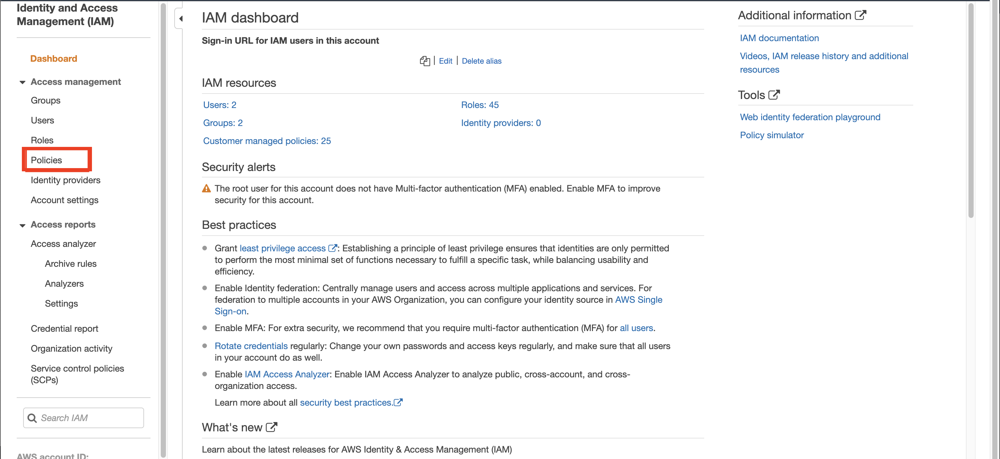

1. Press the **Create policy** button at the top of the screen.

   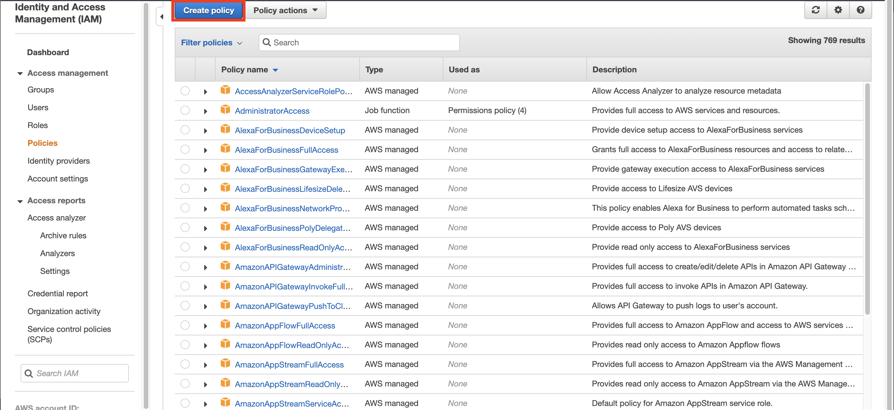

1. Select the **JSON** tab.

   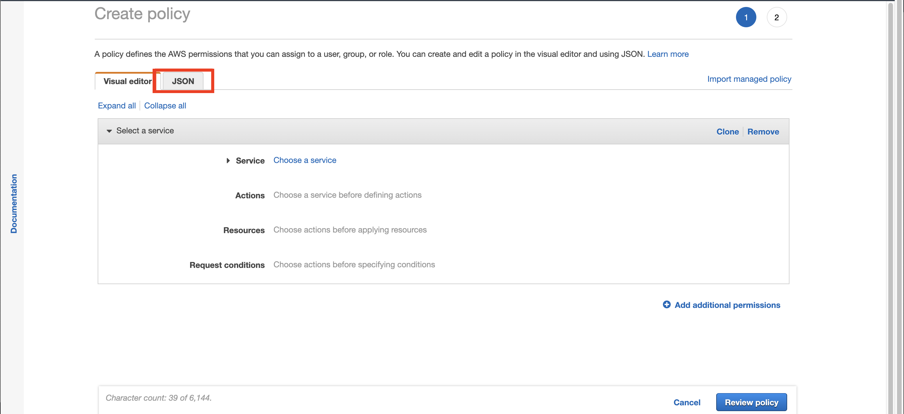

1. Copy the below JSON document, and paste into the visual editor, replacing the existing policy.  Press  **Review policy** in the bottom right of the page.
    ```json
    {
        "Version": "2012-10-17",
        "Statement": [
            {
                "Sid": "GreenGrassIoTAccess",
                "Effect": "Allow",
                "Action": [
                    "iot:Connect",
                    "iot:Publish",
                    "iot:Subscribe",
                    "iot:Receive",
                    "iot:GetThingShadow",
                    "iot:UpdateThingShadow",
                    "iot:DeleteThingShadow"
                ],
                "Resource": "*"
            },
            {
                "Sid": "GreenGrassS3ObjectAccess",
                "Effect": "Allow",
                "Action": [
                    "s3:ListBucket",
                    "s3:GetObject",
                    "s3:PutObject"
                ],
                "Resource": [
                    "arn:aws:s3:::sagemaker*/smart-recycle-kit/*",
                    "arn:aws:s3:::sagemaker*",
                    "arn:aws:s3:::reinvent2018-recycle-arm-us-east-1/*",
                    "arn:aws:s3:::reinvent2018-recycle-arm-us-east-1"
                ]
            },
            {
                "Sid": "GreenGrassCloudWatchAccess",
                "Effect": "Allow",
                "Action": [
                    "logs:CreateLogStream",
                    "logs:DescribeLogStreams",
                    "logs:PutLogEvents",
                    "logs:CreateLogGroup"
                ],
                "Resource": "arn:aws:logs:*:*:log-group:/aws/greengrass/*"
            }
        ]
    }
    ```
    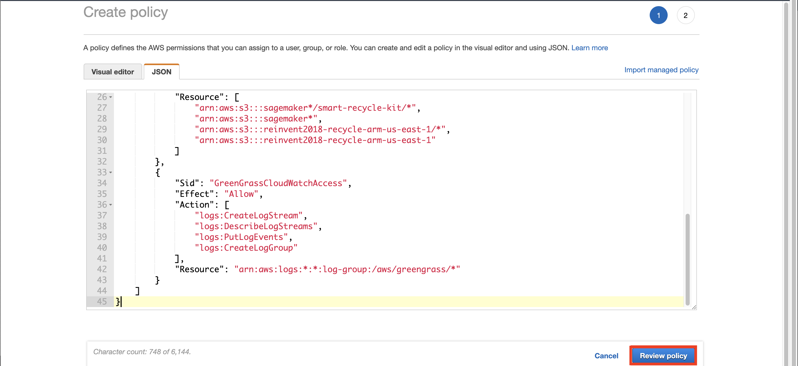

1. Give the policy a name, in the example below we have used **RecycleKitPolicy**.  Press **Create policy**.

   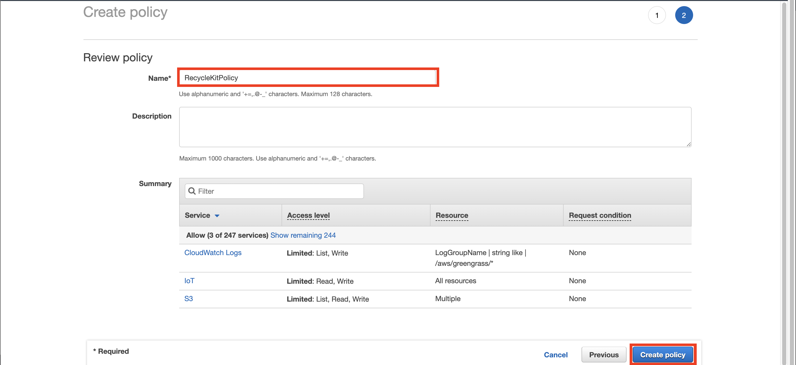

1. Press **Roles** in the menu on the right, then press **Create role**.

   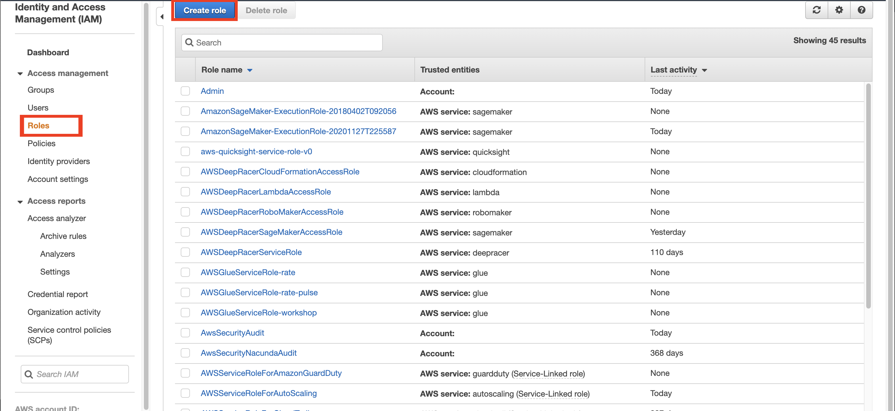

1. Select **Greengrass**, and press **Next: Permissions**.

   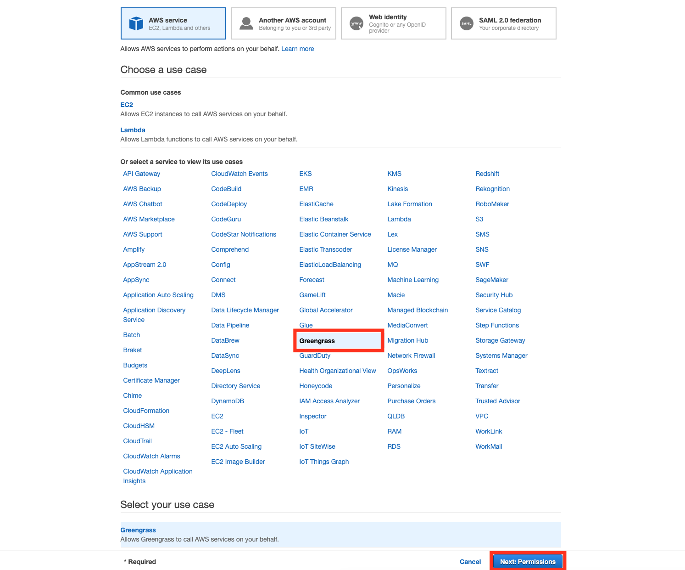

1. On the Attach permissions policies, filter the policy list down by typing the name of the policy created in the previous step. Our policy was given the name **RecycleKitPolicy**.  So as we start typing this into the search field, the policy is filtered.  Then select the radio button next to the Policy name.

   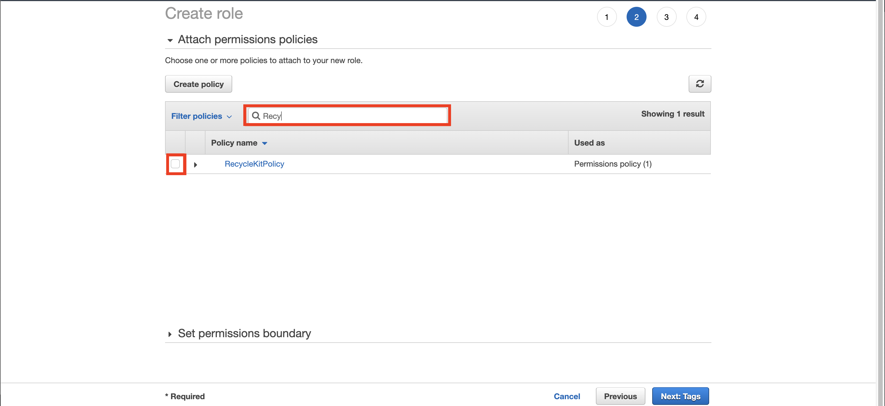

1. After you select the policy, it should look like the image below, then press **Next:Tags**.

   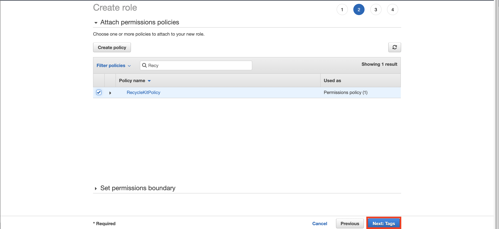

1. Press **Next: Review**

   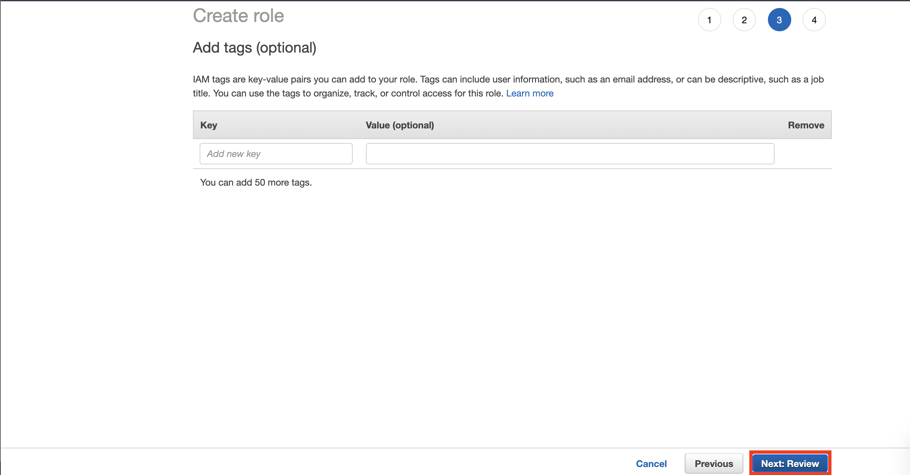

1. Enter a name for the Role created, we have selected to use `RecycleKitGGGroupRole`, since the role will be assigned to the Greengrass group for the Recycle Kit.  Press **Create role** to finish the creation process.

   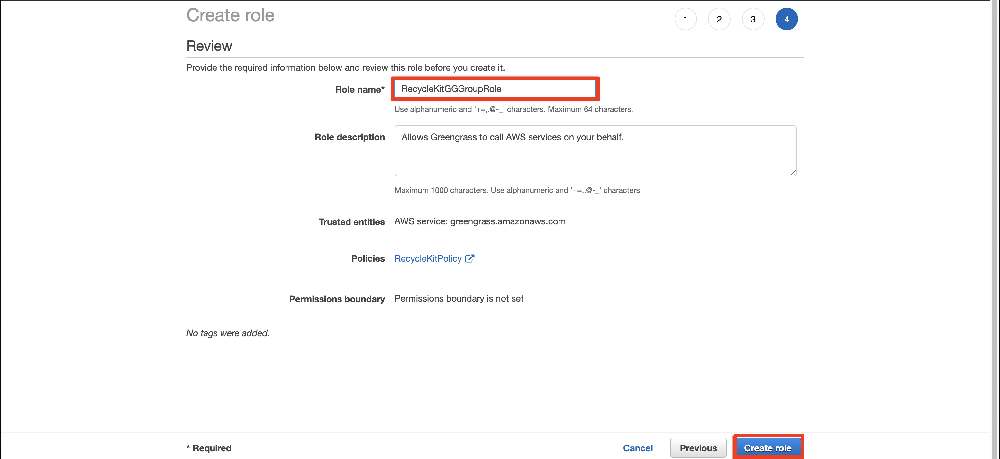


## Create Lambda function

1. Open an AWS Console to [Lambda](https://console.aws.amazon.com/lambda/home) and Click in the upper right corner on **Create function**.

    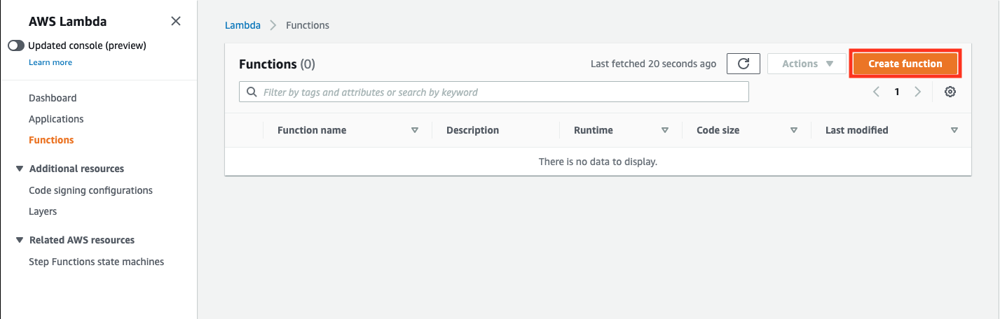

1.  Fill in the **Function name** of `gg-pi-recycle` and select the **Runtime** of `Python 3.7` as shown below. Press **Create function** at the bottom right of the page.

    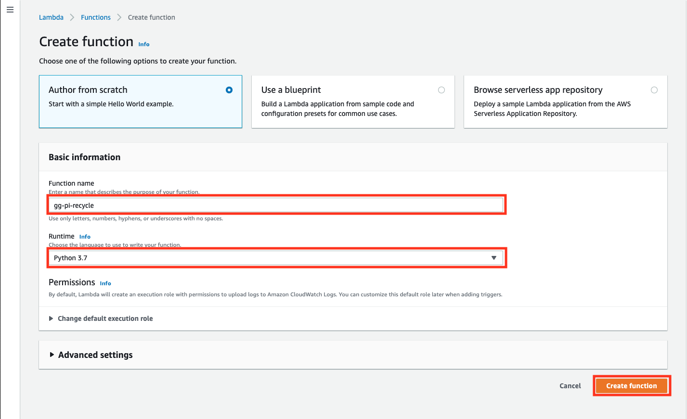

1. Click on **Actions**, then **Upload a file from Amazon S3**.

    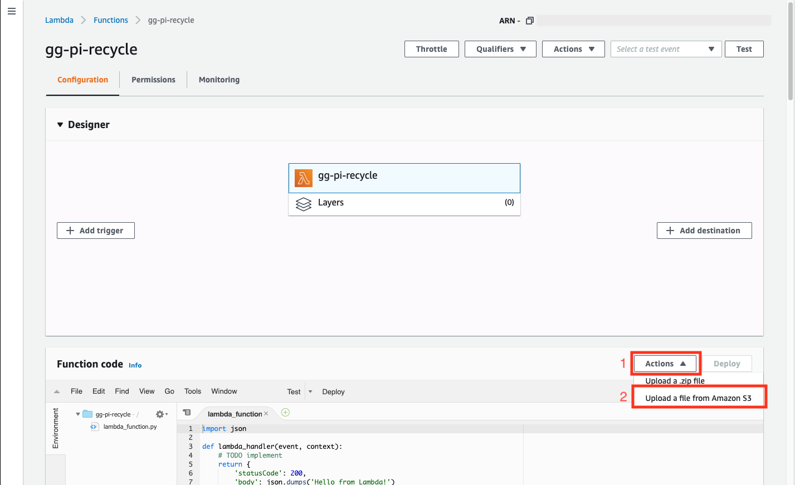

1. Enter `https://reinvent2018-recycle-arm-us-east-1.s3.amazonaws.com/2020/lambda/gg-pi-recycle.zip` into the input field and press **Save**.

    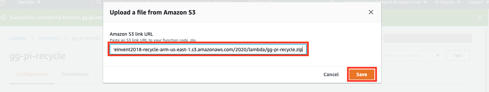

1. This zip file has a deployment package of a Lambda function and a folder that contains the Greengrass SDK.  Press **Actions**.

    

1. Once **Actions** is pressed this will show a menu, press **Publish new version**.

    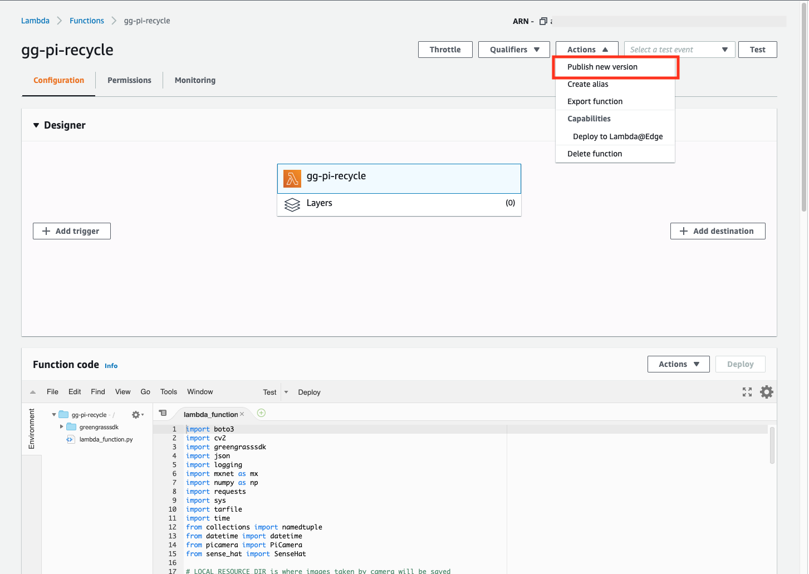

1. Press **Publish** to publish a version of the Lambda function.    
    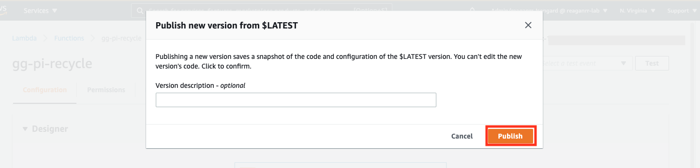

1. Press **Actions** again, and this time select **Create alias**.   

    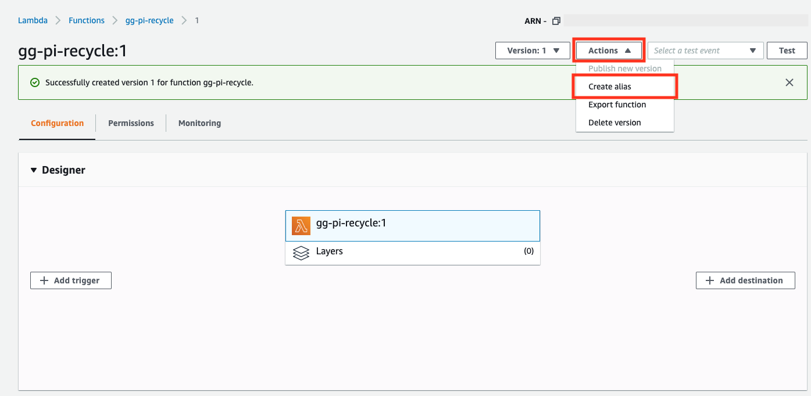

1. Enter a **Name** for the alias.  We chose `ggc` since this will piont to the version of the Lambda function that is uploaded to the Greengrass core.  Then after entering a name, press **Save**.

    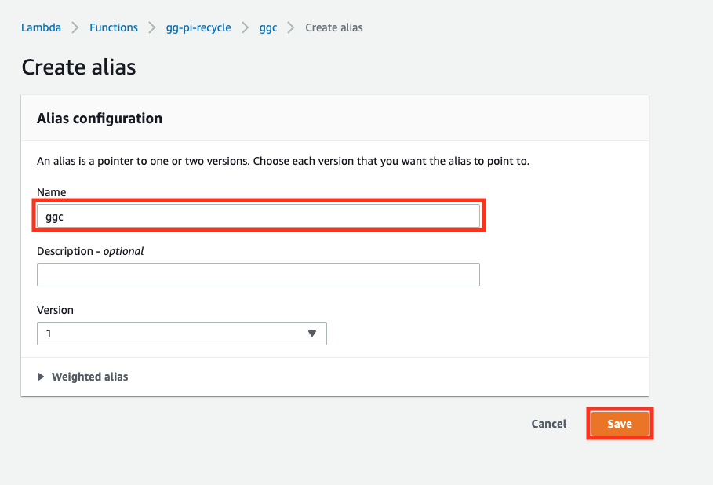

## Add Lambda function to Greengrass group

1. Open [IoT Core](https://https://console.aws.amazon.com/iot/home) on your computer and navigate to the Greengrass group you created earlier, then select **Lambdas** in the menu on the left.

    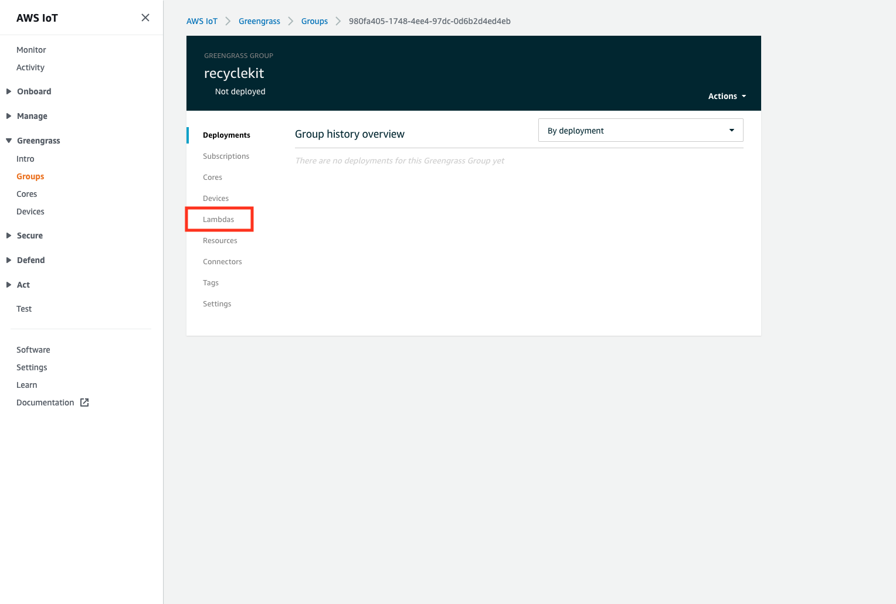

1. Now to add the Lambda function to the Greengrass group, Select **Add your first Lambda**.

    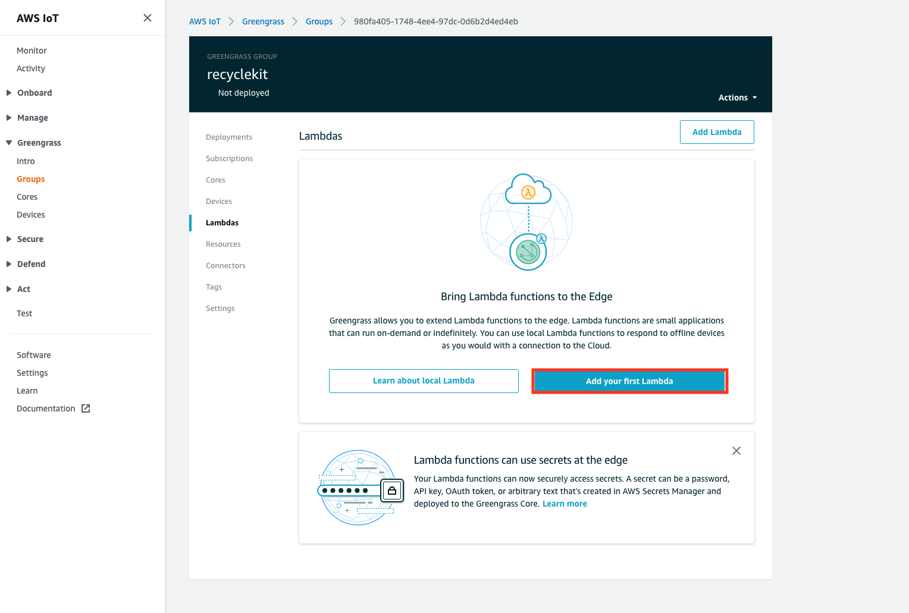

1. Select either **Use existing Lambda** button.

    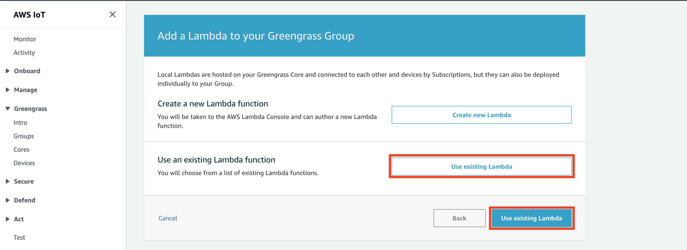

1. Select the radio button next to the Lambda function that was created, our example was named `gg-pi-recycle`.

    

1. After you slect the correct Lambda function, press **Next**.

    

1. Select the alias name that your created, in the example below, the alias is `ggc`.  Press **Finish**.

    

1. Click the **...** on the upper right corner of the Lambda function that was just added.

    

1. Select **Edit configuration**.

    

1. There are some Greengrass group specific Lambda configuration updates that need to be made.  Since the Lambda function needs to interact directly with the SenseHAT, it needs to run as root and not in a container.  We updated the config.json on the Raspberry Pi earlier to allow Greengrass functions to run as root, which is not allowed by default.  Select the radio buttons next to **Another user ID/group ID**, **No container**, and **Make this function long-lived and keep it running indefinitely**.

    

1. After the radio buttons have been selected, enter the UID of `0` and GID of `0`.  Also change the timeout value to 30 seconds.

    

1. After updating those parameters, Press **Update**.

    

## Update Greengrass group settings

1. Navigate back to your Greengrass group by selecting the group id link at the top of the screen as shown in the image below.

    

1. Select **Settings** in the left menu.

    

1. Select **Add Role** next to `Group Role`.

    

1. Select the radio button next to the IAM Role that was created for the Greengrass group, we used `RecycleKitGGGroupRole`.

    

1. After selecting the IAM Role, Press **Save**.

    

1. Scroll down and Press **Edit** next to `Stream manager`. 

    

1. Select the radio button next to `Disable` and press **Save**.

    

1. Select **Edit** next to `CloudWatch logs configuration`.

    

1. Select **Add another log type**.

    

1. Select both `User Lambdas (recommended)` and `Greengrass system`, then press **Update**.

    
   
1. Then press **Save**.

    

1.  Select **Edit** next to `Local logs configuration`, to start the ssame process we did previously, but this time for configuring logs on the local Greengrass Core.

    

1. Select **Add another log type**.

    

1. Select both `User Lambdas (recommended)` and `Greengrass system`, then press **Update**.

    

1. Then press **Save**.

    

1. Select **Subscriptions** in the menu on the left, then Press **Add your first Subscription**.

    

1. Click **Select** on a `Select a Source` 

    

1. Select **Lambdas** and the Lambda function, `gg-pi-recycle`. Click **Select** on a `Select a Target`. 

    

1. Select **Services** and `IoT Cloud`. Then press **Next**. 

    

1. Select the `Topic Filter` and enter `recycle/info`.  Press **Next**.

    

1. Press **Finish**.

    

## Deploy to Greengrass Core

1. Select **Deployments** in the left menu, then press **Actions**.

    

1. Select **Deploy** from the **Actions** menu.

    

1. Press **Automatic detection**.

    

1. `Building deployment` and `Deployment in progress` will show an orage status icon, until the deployment has completed.

    

1. When the Deployment is completed and successful, there will be a green status icon and a `Successfully completed` message.

    


# Congratulations you have finished the Smart Recycle Kit build and deployment process.

You can now test your model by pressing the joystick on the SenseHAT once you see an orange question mark on the SenseHAT lights.